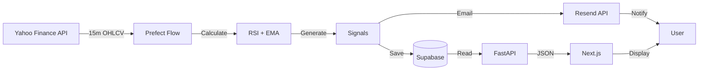
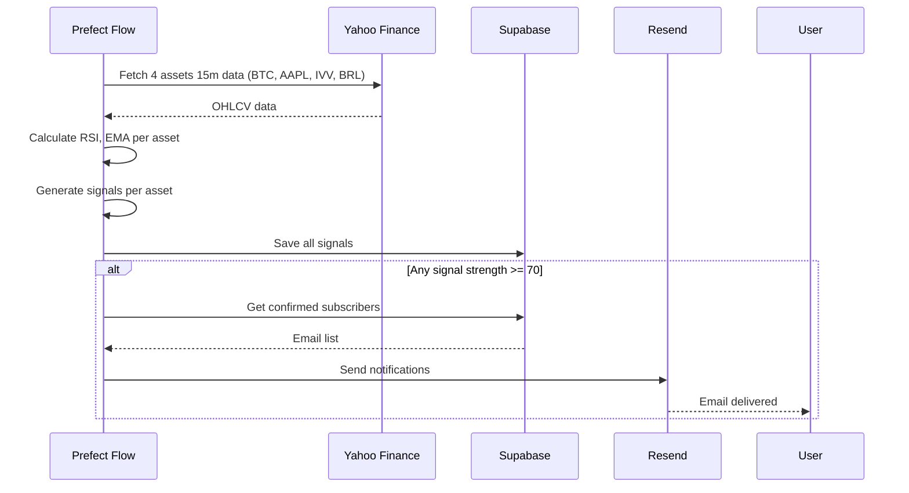
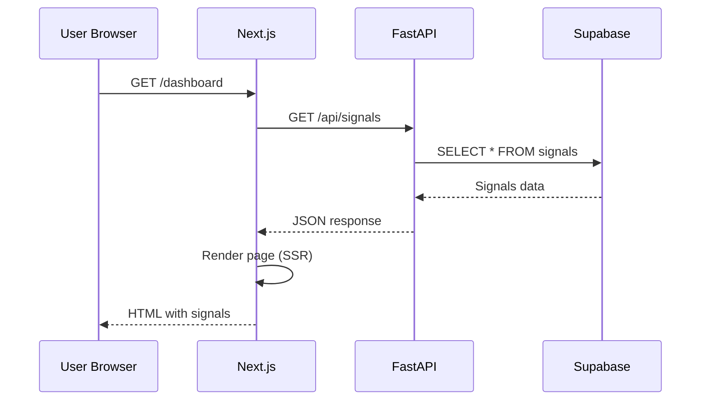

# System Architecture

## Overview

This MVP is a lean, end‑to‑end signals system optimized for a small development team. A single Prefect flow fetches 15‑minute OHLCV data from Yahoo Finance for four assets, computes RSI/EMA, generates rule‑based signals with a strength score, persists results to Supabase, triggers emails via Resend on strong signals, and serves read‑only data via a FastAPI backend consumed by a Next.js frontend.

- **Scope (MVP)**: 4 assets, 15‑minute bars, RSI + EMA indicators, rule‑based signals, email notifications, read‑only dashboard.
- **Non‑goals (MVP)**: Auth, multi‑timeframe resampling, per‑asset custom logic, Telegram/other channels, advanced backtesting.
- **Operational model**: Scheduled every 15 minutes with retries and logging in Prefect; simple, single‑flow design for speed and reliability.

See the data flow diagram below for the detailed sequence.

## High-Level Data Flow



## Components

### 1. Data Pipeline (Prefect)

**Purpose**: Fetch data, calculate indicators, generate signals

**Single Flow Approach**: Start with one flow that does everything, split later if needed

**Flow Structure**:

```python
generate_signals_flow():
  # 1. Fetch 15m data from Yahoo Finance (BTC-USD, AAPL, IVV, BRL=X)
  # 2. Calculate RSI (14-period) and EMA (12/26) for each asset
  # 3. Apply signal rules (RSI < 30 = BUY, etc.) - same logic for all assets
  # 4. Calculate strength score (0-100) per asset
  # 5. Save to Supabase
  # 6. If any asset signal strength >= 70, send email via Resend
```

**Schedule**: Every 15 minutes (`*/15 * * * *`)

**Error Handling**:

- Retry 3 times with exponential backoff (Prefect built-in)
- Log errors to Prefect Cloud
- Alert on 2 consecutive failures

**Key Decisions**:

- Fetch 15m data directly (no 5m → 15m resampling in MVP)
- Single flow keeps it simple for small dev team
- Use `@task` decorators for testable units
- Prefect handles scheduling, retries, logging
- Same indicator logic for all asset types (asset-agnostic approach)
- Ignore market hours in MVP (24/7 operation, even for stocks/ETFs)

---

### 2. Database (Supabase)

**Purpose**: Store assets, OHLCV data, indicators, signals, and subscribers

**Core Tables** (5 essential):

1. **assets** - Tracks 4 asset types: BTC-USD (crypto), AAPL (stocks), IVV (ETF), BRL=X (forex)
2. **ohlcv** - Raw 15-minute price data for all assets
3. **indicators** - RSI, EMA-12, EMA-26 values per asset
4. **signals** - Generated BUY/HOLD signals with strength scores per asset
5. **email_subscribers** - Double opt-in subscribers with tokens

**Key Design Decisions**:

- Single `ohlcv` table (no 5m/15m split in MVP)
- `UNIQUE(asset_id, timestamp)` prevents duplicates
- Indexes on `(asset_id, timestamp DESC)` for fast time-series queries
- `confirmed` flag on subscribers for double opt-in

**Schema Location**: `db/schema.sql`

**Seed Data**: `db/seeds/symbols.sql` (BTC-USD, AAPL, IVV, BRL=X)

---

### 3. Backend API (FastAPI)

**Purpose**: Serve signals and market data to frontend

**Core Endpoints** (Keep it minimal):

- `GET /api/signals` - List recent signals (with pagination)
- `GET /api/signals/{id}` - Single signal with OHLCV context
- `POST /api/subscribe` - Start double opt-in flow
- `GET /api/confirm` - Confirm email subscription
- `GET /api/unsubscribe` - Unsubscribe from emails
- `GET /api/health` - System health check

**Key Patterns**:

- Use Pydantic models for request/response validation
- Supabase client for database queries
- Async endpoints for better performance
- CORS configured for frontend domain
- Rate limiting: 100 req/min per IP

**Tech Stack**:

- FastAPI for routing and validation
- SQLAlchemy for database queries (optional, can use Supabase client directly)
- Resend for email sending
- PostHog for analytics events

---

### 4. Frontend (Next.js)

**Purpose**: Landing page and dashboard

**Page Structure** (App Router):

```bash
app/
├── page.tsx              # Landing page
├── dashboard/page.tsx    # Signal list
├── signals/page.tsx      # Signal list
└── signals/[symbol]/page.tsx  # Signal detail with chart
```

**Key Components**:

- `<SignalCard />` - Display signal summary
- `<PriceChart />` - Chart with indicators overlaid
- `<EmailSignup />` - Subscription form with validation
- `<StrengthBadge />` - Color-coded strength indicator

**Design System**:

- TailwindCSS for styling
- Dark theme inspired by Resend
- Minimal, professional aesthetic
- Responsive mobile-first design

**Data Fetching Strategy**:

- Server Components for initial page loads (SEO)
- Consider TanStack Query for client-side data management (post-MVP)
- Start with simple fetch, optimize later

**State Management**:

- Server Components reduce need for client state
- React Context for theme/user preferences (if needed)
- Keep it simple - avoid over-engineering

---

### 5. Email Service (Resend)

**Purpose**: Send signal notifications

**Email Flow**:

1. User subscribes → Confirmation email sent
2. User clicks link → Subscription confirmed → Welcome email
3. Strong signal generated → Notification email sent
4. User can unsubscribe via one-click link

**Email Types**:

- **Confirmation**: Double opt-in verification
- **Welcome**: What to expect, how to read signals
- **Signal Notification**: Plain English explanation with reasoning
- **Digest** (Phase 2): Weekly summary

**Configuration Requirements**:

- DKIM/SPF/DMARC setup for domain
- `List-Unsubscribe` header for compliance
- Webhooks for tracking opens/bounces

---

## Data Flow Sequence

### Every 15 Minutes (Automated)



### User Visits Dashboard



---

## Technology Choices

### Why Supabase?

- You already know it
- PostgreSQL (reliable, mature)
- Free tier: 500MB storage, unlimited API requests
- Built-in auth (for Phase 2)
- Real-time subscriptions (for Phase 2)

### Why Prefect?

- Python-native (same as FastAPI)
- Built-in scheduling (no cron needed)
- Retry logic and error handling
- Observability dashboard
- Free tier: 20K task runs/month

### Why FastAPI?

- Fast (async support)
- Auto-generated docs (Swagger UI)
- Type safety (Pydantic)
- Easy to learn coming from Node.js/NestJS
- Share code with Prefect flows

### Why Next.js?

- Your core expertise
- Server-side rendering (SEO)
- Vercel deployment (free, instant)
- React Server Components (less JS)
- App Router with built-in patterns

### Why Resend?

- Simple API
- High deliverability (DKIM/SPF/DMARC)
- Free tier: 3K emails/month
- Webhooks for tracking
- Great developer experience

---

## Deployment

### Vercel (Frontend + API)

- Frontend: Automatic deployment from main branch
- Backend: Deploy as Vercel Serverless Functions (or separate if preferred)
- Environment variables configured in Vercel dashboard

### Prefect Cloud (Pipeline)

- Deploy flow with `prefect deploy`
- Schedule configured in Prefect Cloud UI
- Logs and monitoring built-in

### Supabase (Database)

- Create project at supabase.com
- Run migrations via SQL editor
- Connection string in environment variables

---

## Integration Points

### Pipeline → Database

Prefect flows write directly to Supabase using connection string.
Use SQLAlchemy or Supabase Python client.

### Database → API

FastAPI reads from Supabase using async queries.
Consider connection pooling for production.

### API → Frontend

Next.js fetches from FastAPI endpoints.
Server Components for initial load, client fetching for interactivity.

### Resend Integration

Used in both Prefect (notifications) and FastAPI (confirmations).
Same API key, different purposes.

---

## Security Considerations

### API Security

- Rate limiting: 100 req/min per IP
- CORS: Whitelist frontend domain only
- Input validation: Pydantic schemas on all endpoints
- SQL injection: Use parameterized queries

### Database Security

- SSL/TLS connections required
- Environment variables for credentials (never in code)
- Row-level security in Supabase (Phase 2)

### Email Security

- Double opt-in prevents spam signups
- Unsubscribe tokens: 32-byte random (cryptographically secure)
- List-Unsubscribe header for RFC 8058 compliance
- DKIM/SPF/DMARC prevents email spoofing

---

## Monitoring

### Health Checks

- Prefect Cloud: Flow run history, task durations
- Supabase: Query performance, connection pool
- Vercel: Page load times, API response times
- PostHog: User events, funnels

### Alerts (Set up after MVP works)

- Prefect: Email on flow failure
- Supabase: Monitor connection pool usage
- Resend: Webhook for bounce rate spikes

---

## Next Steps

1. Set up Supabase project and run migrations
2. Implement Prefect flow locally (test with manual run)
3. Build FastAPI endpoints (test with Swagger UI)
4. Create Next.js pages (start with landing page)
5. Deploy and test end-to-end

For indicator details, see [DATA-SCIENCE.md](DATA-SCIENCE.md)

For project scope, see [MVP.md](MVP.md)
