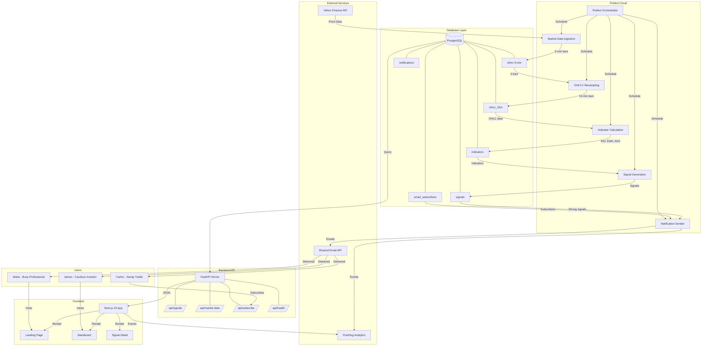
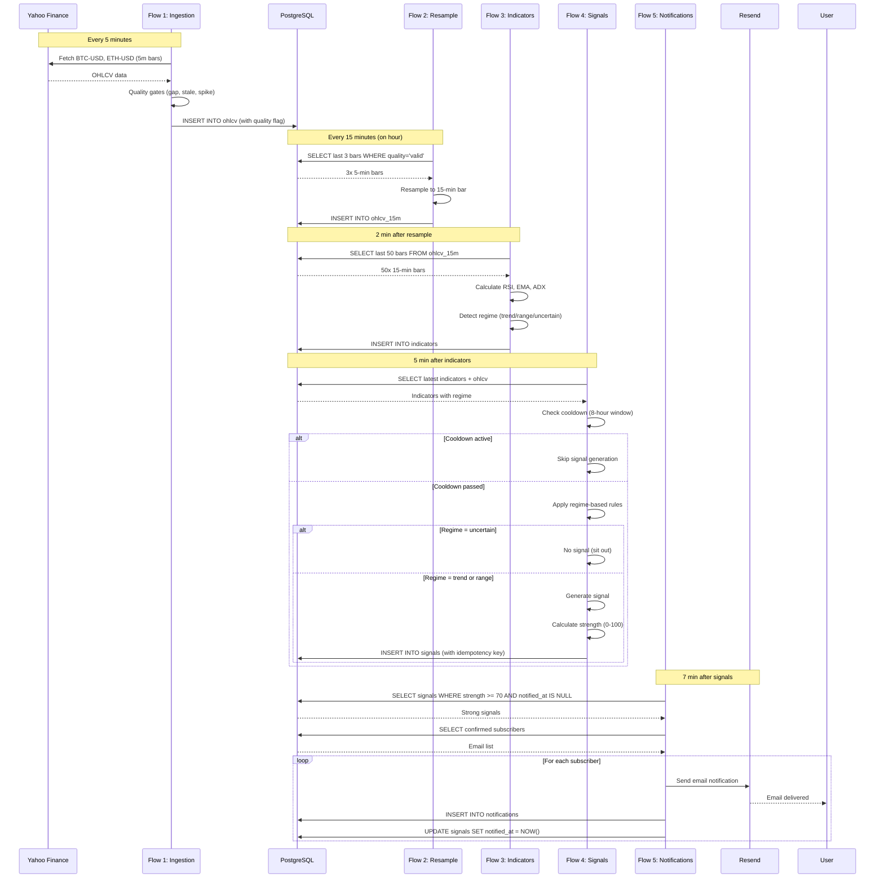
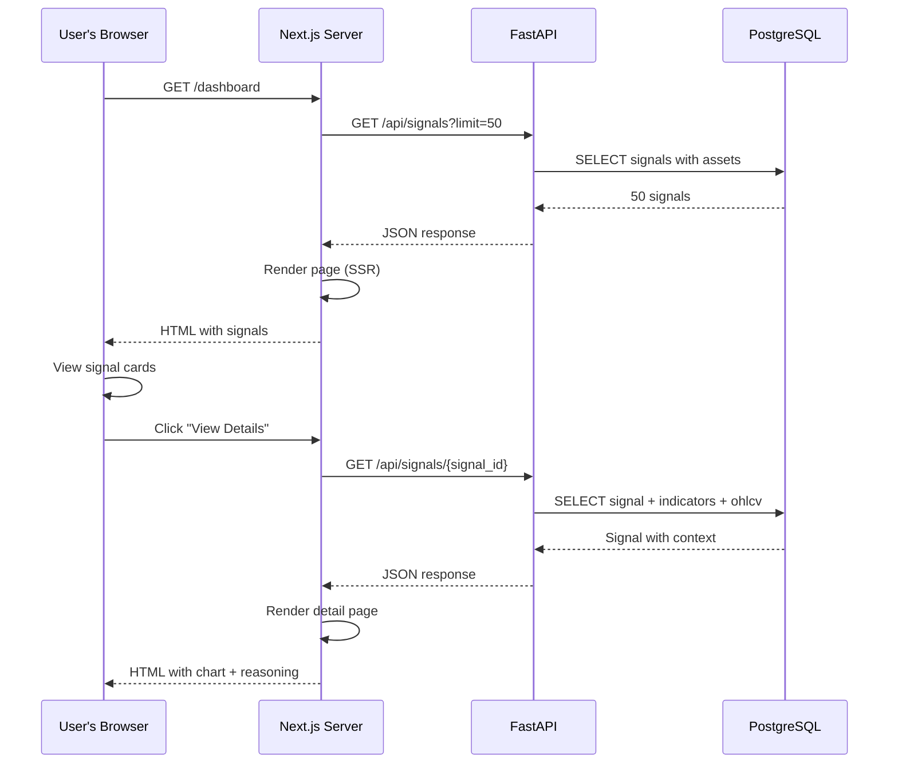

# System Architecture

## Overview

This document describes the complete system architecture for the Trading Signals MVP, including component relationships, data flows, technology choices, and deployment strategy.

## High-Level Architecture Diagram



---

## Component Deep Dive

### 1. Data Pipeline (Prefect)

**Purpose:** Orchestrate 5 flows that fetch, process, analyze, and notify

**Technology:** Prefect 2.x on Prefect Cloud

**Why Prefect:**

- Built-in scheduling (no need for cron jobs)
- Flow observability (see exactly what's running)
- Retries and error handling out of the box
- Python-native (integrates with pandas, yfinance)
- Free tier supports MVP scale

#### Flow 1: Market Data Ingestion

**Schedule:** Every 5 minutes (`*/5 * * * *`)

**Responsibilities:**

1. Fetch latest OHLCV data from Yahoo Finance API
2. Run quality gates (gap, staleness, spike checks)
3. Store valid bars in `ohlcv` table
4. Flag invalid bars with `data_quality` field
5. Track event in PostHog

**Tasks:**

```python
@task(name="fetch-yahoo-finance")
def fetch_ohlcv(asset_id: str, interval: str = "5m") -> pd.DataFrame:
    """Fetch last 5 minutes of data from Yahoo Finance."""
    ticker = yfinance.Ticker(asset_id)
    df = ticker.history(period="1d", interval=interval)
    return df

@task(name="quality-gate-check")
def quality_gate(df: pd.DataFrame, asset_id: str) -> tuple[pd.DataFrame, str]:
    """
    Run quality checks:
    - Gap check: Missing prior bar?
    - Staleness check: Data <10 min old?
    - Spike check: Price jump >5%?
    """
    quality = "valid"

    # Gap check
    prior_close = get_prior_close(asset_id, latest_timestamp)
    if prior_close is None:
        quality = "gap"

    # Staleness check
    age_minutes = (datetime.now(UTC) - latest_timestamp).seconds / 60
    if age_minutes > 10:
        quality = "stale"

    # Spike check
    if prior_close:
        price_change_pct = abs((latest_close - prior_close) / prior_close * 100)
        if price_change_pct > 5:
            quality = "spike"

    return df, quality

@task(name="store-ohlcv")
def store_ohlcv(df: pd.DataFrame, asset_id: str, quality: str):
    """Insert into ohlcv table with quality flag."""
    for _, row in df.iterrows():
        insert_query = """
            INSERT INTO ohlcv (id, asset_id, timestamp, open, high, low, close, volume, data_quality)
            VALUES (gen_random_uuid(), :asset_id, :timestamp, :open, :high, :low, :close, :volume, :quality)
            ON CONFLICT (asset_id, timestamp) DO NOTHING
        """
        execute(insert_query, {**row, "asset_id": asset_id, "quality": quality})
```

**Error Handling:**

- If Yahoo Finance fails, retry 3 times with exponential backoff
- If all retries fail, send alert to ops team
- If 2 consecutive failures, trigger global kill switch

---

#### Flow 2: OHLCV Resampling

**Schedule:** Every 15 minutes on the hour (`0,15,30,45 * * * *`)

**Responsibilities:**

1. Fetch last 3x 5-minute bars from `ohlcv` (where `data_quality = 'valid'`)
2. Resample into 1x 15-minute bar:
   - `open` = first bar's open
   - `high` = max of 3 highs
   - `low` = min of 3 lows
   - `close` = last bar's close
   - `volume` = sum of 3 volumes
3. Store in `ohlcv_15m` table with `bar_count` field
4. Track event in PostHog

**Tasks:**

```python
@task(name="resample-to-15m")
def resample_to_15m(asset_id: str) -> pd.DataFrame:
    """
    Resample 3x 5-min bars into 1x 15-min bar.
    Only use bars with data_quality = 'valid'.
    """
    query = """
        SELECT timestamp, open, high, low, close, volume
        FROM ohlcv
        WHERE asset_id = :asset_id
          AND data_quality = 'valid'
          AND timestamp > NOW() - INTERVAL '20 minutes'
        ORDER BY timestamp DESC
        LIMIT 3
    """
    bars = fetch(query, {"asset_id": asset_id})

    if len(bars) < 3:
        raise ValueError(f"Only {len(bars)} bars available (need 3)")

    resampled = {
        "timestamp": bars[0]["timestamp"],  # Latest timestamp
        "open": bars[2]["open"],            # First bar's open
        "high": max(b["high"] for b in bars),
        "low": min(b["low"] for b in bars),
        "close": bars[0]["close"],          # Last bar's close
        "volume": sum(b["volume"] for b in bars),
        "bar_count": 3
    }

    return pd.DataFrame([resampled])

@task(name="store-15m-bar")
def store_15m_bar(df: pd.DataFrame, asset_id: str):
    """Insert into ohlcv_15m table."""
    insert_query = """
        INSERT INTO ohlcv_15m (id, asset_id, timestamp, open, high, low, close, volume, bar_count)
        VALUES (gen_random_uuid(), :asset_id, :timestamp, :open, :high, :low, :close, :volume, :bar_count)
        ON CONFLICT (asset_id, timestamp) DO NOTHING
    """
    execute(insert_query, {**df.iloc[0], "asset_id": asset_id})
```

**Error Handling:**

- If <3 valid bars available, log warning but don't fail
- If resampling fails, alert ops team
- Never store bars with `bar_count < 3`

---

#### Flow 3: Indicator Calculation

**Schedule:** 2 minutes after resampling (`2,17,32,47 * * * *`)

**Responsibilities:**

1. Fetch last 50x 15-minute bars from `ohlcv_15m` (for EMA calculation warmup)
2. Calculate RSI (14-period)
3. Calculate EMA-12 and EMA-26
4. Calculate ADX (14-period) for regime detection
5. Store in `indicators` table with `regime` field
6. Track event in PostHog

**Tasks:**

```python
@task(name="calculate-indicators")
def calculate_indicators(asset_id: str) -> dict:
    """
    Calculate RSI, EMA, ADX from 15-min bars.
    Returns latest indicator values.
    """
    query = """
        SELECT timestamp, open, high, low, close, volume
        FROM ohlcv_15m
        WHERE asset_id = :asset_id
        ORDER BY timestamp DESC
        LIMIT 50
    """
    df = fetch_dataframe(query, {"asset_id": asset_id})
    df = df.sort_values("timestamp")  # Oldest first

    # RSI
    rsi = calculate_rsi(df, period=14)

    # EMA
    ema_12 = df["close"].ewm(span=12, adjust=False).mean()
    ema_26 = df["close"].ewm(span=26, adjust=False).mean()

    # ADX
    adx = calculate_adx(df, period=14)

    # Regime detection
    regime = detect_regime(adx.iloc[-1])

    return {
        "timestamp": df.iloc[-1]["timestamp"],
        "rsi": rsi.iloc[-1],
        "ema_12": ema_12.iloc[-1],
        "ema_26": ema_26.iloc[-1],
        "adx": adx.iloc[-1],
        "regime": regime
    }

@task(name="store-indicators")
def store_indicators(indicators: dict, asset_id: str):
    """Insert into indicators table."""
    insert_query = """
        INSERT INTO indicators (id, asset_id, timestamp, rsi, ema_12, ema_26, adx, regime)
        VALUES (gen_random_uuid(), :asset_id, :timestamp, :rsi, :ema_12, :ema_26, :adx, :regime)
        ON CONFLICT (asset_id, timestamp) DO UPDATE SET
            rsi = EXCLUDED.rsi,
            ema_12 = EXCLUDED.ema_12,
            ema_26 = EXCLUDED.ema_26,
            adx = EXCLUDED.adx,
            regime = EXCLUDED.regime
    """
    execute(insert_query, {**indicators, "asset_id": asset_id})
```

**Error Handling:**

- If <50 bars available, calculate with available data (but log warning)
- If any indicator calculation fails, log error but continue with others
- Never store indicators without regime classification

---

#### Flow 4: Signal Generation

**Schedule:** 5 minutes after indicators (`5,20,35,50 * * * *`)

**Responsibilities:**

1. Fetch latest indicators from `indicators` table
2. Fetch latest OHLCV from `ohlcv_15m` table
3. Apply regime-based signal rules:
   - Trend regime → EMA crossover signals
   - Range regime → RSI mean-reversion signals
   - Uncertain regime → No signals
4. Check cooldown (8-hour window per asset per rule)
5. Calculate signal strength (0-100)
6. Generate plain English reasoning
7. Store signal in `signals` table with idempotency key
8. Track event in PostHog

**Tasks:**

```python
@task(name="generate-signals")
def generate_signals(asset_id: str) -> dict | None:
    """
    Generate signal based on regime and indicators.
    Returns None if no signal or cooldown active.
    """
    # Fetch latest indicators
    indicators = fetch_latest_indicators(asset_id)
    ohlcv = fetch_latest_ohlcv_15m(asset_id)

    # Check regime
    regime = indicators["regime"]
    if regime == "uncertain":
        return None  # Sit out ambiguous periods

    # Check cooldown
    rule_version = "rsi_v1" if regime == "range" else "ema_v1"
    if check_cooldown(asset_id, rule_version):
        return None  # Already signaled recently

    # Generate signal
    signal = None

    if regime == "range":
        # RSI mean-reversion
        if indicators["rsi"] < 30:
            signal = {
                "signal_type": "BUY",
                "reasoning": [
                    f"RSI oversold ({indicators['rsi']:.1f})",
                    "Price likely to bounce in ranging market",
                    f"ADX low ({indicators['adx']:.1f}) confirms sideways movement"
                ],
                "rule_version": "rsi_v1"
            }
        elif indicators["rsi"] > 70:
            signal = {
                "signal_type": "SELL",
                "reasoning": [
                    f"RSI overbought ({indicators['rsi']:.1f})",
                    "Price may pull back in ranging market",
                    f"ADX low ({indicators['adx']:.1f}) confirms sideways movement"
                ],
                "rule_version": "rsi_v1"
            }

    elif regime == "trend":
        # EMA crossover
        ema_12_prev = fetch_previous_indicator(asset_id, "ema_12")
        ema_26_prev = fetch_previous_indicator(asset_id, "ema_26")

        if ema_12_prev <= ema_26_prev and indicators["ema_12"] > indicators["ema_26"]:
            signal = {
                "signal_type": "BUY",
                "reasoning": [
                    "EMA-12 crossed above EMA-26 (golden cross)",
                    f"ADX strong ({indicators['adx']:.1f}) confirms trend",
                    "Momentum turning bullish"
                ],
                "rule_version": "ema_v1"
            }
        elif ema_12_prev >= ema_26_prev and indicators["ema_12"] < indicators["ema_26"]:
            signal = {
                "signal_type": "SELL",
                "reasoning": [
                    "EMA-12 crossed below EMA-26 (death cross)",
                    f"ADX strong ({indicators['adx']:.1f}) confirms trend",
                    "Momentum turning bearish"
                ],
                "rule_version": "ema_v1"
            }

    if signal is None:
        return None

    # Calculate strength
    strength = calculate_strength(indicators, signal["signal_type"], regime)

    # Generate idempotency key
    signaled_at = indicators["timestamp"]
    idempotency_key = f"{asset_id}:{rule_version}:{signaled_at.isoformat()}"

    return {
        **signal,
        "asset_id": asset_id,
        "signaled_at": signaled_at,
        "regime": regime,
        "strength": strength,
        "price_at_signal": ohlcv["close"],
        "idempotency_key": idempotency_key,
        "reasoning_text": " → ".join(signal["reasoning"])
    }

@task(name="store-signal")
def store_signal(signal: dict):
    """Insert into signals table with idempotency check."""
    insert_query = """
        INSERT INTO signals (
            id, asset_id, signal_type, regime, signaled_at, strength,
            price_at_signal, rule_version, reasoning, idempotency_key
        )
        VALUES (
            gen_random_uuid(), :asset_id, :signal_type, :regime, :signaled_at,
            :strength, :price_at_signal, :rule_version, :reasoning_text, :idempotency_key
        )
        ON CONFLICT (idempotency_key) DO NOTHING
    """
    execute(insert_query, signal)
```

**Error Handling:**

- If indicators are missing, log error and skip signal generation
- If strength calculation fails, default to 50 (neutral)
- Never override cooldown period (safety mechanism)

---

#### Flow 5: Notification Sender

**Schedule:** 7 minutes after signals (`7,22,37,52 * * * *`)

**Responsibilities:**

1. Fetch signals with `strength >= 70` and `notified_at IS NULL`
2. Fetch confirmed email subscribers from `email_subscribers`
3. Generate HTML email with plain English explanation
4. Send via Resend API
5. Store notification record in `notifications` table
6. Update signal's `notified_at` timestamp
7. Track event in PostHog

**Tasks:**

```python
@task(name="fetch-strong-signals")
def fetch_strong_signals() -> list[dict]:
    """Fetch unsent signals with strength >= 70."""
    query = """
        SELECT s.*, a.name, a.display_name
        FROM signals s
        JOIN assets a ON s.asset_id = a.id
        WHERE s.strength >= 70
          AND s.notified_at IS NULL
        ORDER BY s.signaled_at DESC
    """
    return fetch_all(query)

@task(name="send-email-notification")
def send_email_notification(signal: dict, subscriber: dict):
    """Send email via Resend API."""
    email_html = render_email_template(signal)

    response = resend.emails.send({
        "from": "signals@yourdomain.com",
        "to": subscriber["email"],
        "subject": f"🟢 {signal['display_name']} {signal['signal_type']} Signal ({signal['strength']}/100)",
        "html": email_html,
        "headers": {
            "List-Unsubscribe": f"<https://yourdomain.com/unsubscribe?token={subscriber['unsubscribe_token']}>"
        }
    })

    return response

@task(name="record-notification")
def record_notification(signal_id: str, subscriber_id: str, resend_id: str):
    """Store notification in database."""
    insert_query = """
        INSERT INTO notifications (id, signal_id, subscriber_id, sent_at, email_provider_id)
        VALUES (gen_random_uuid(), :signal_id, :subscriber_id, NOW(), :resend_id)
    """
    execute(insert_query, {
        "signal_id": signal_id,
        "subscriber_id": subscriber_id,
        "resend_id": resend_id
    })

@task(name="mark-signal-notified")
def mark_signal_notified(signal_id: str):
    """Update signal's notified_at timestamp."""
    update_query = """
        UPDATE signals
        SET notified_at = NOW()
        WHERE id = :signal_id
    """
    execute(update_query, {"signal_id": signal_id})
```

**Error Handling:**

- If Resend fails, retry 3 times
- If all retries fail, log error and continue to next subscriber
- Never mark signal as notified if email send failed
- Track bounces and unsubscribes in separate flow

---

### 2. Backend API (FastAPI)

**Purpose:** Provide REST endpoints for frontend to fetch signals, market data, and manage subscriptions

**Technology:** FastAPI + Pydantic + SQLAlchemy

**Why FastAPI:**

- Automatic OpenAPI docs (great for frontend developers)
- Pydantic validation (type-safe requests/responses)
- Async support (handles multiple concurrent requests)
- Python-native (share code with Prefect flows)
- Fast development velocity

#### API Endpoints

- **GET /api/signals**

```python
@router.get("/signals", response_model=list[SignalResponse])
async def get_signals(
    asset_id: str | None = None,
    limit: int = 10,
    skip: int = 0
):
    """
    Fetch signals with optional filtering.

    Query Parameters:
    - asset_id: Filter by BTC-USD, ETH-USD, etc.
    - limit: Max results (default 10, max 100)
    - skip: Pagination offset

    Returns:
    - List of signals sorted by signaled_at DESC
    """
    query = """
        SELECT s.*, a.name, a.display_name, a.icon_url
        FROM signals s
        JOIN assets a ON s.asset_id = a.id
        WHERE (:asset_id IS NULL OR s.asset_id = :asset_id)
        ORDER BY s.signaled_at DESC
        LIMIT :limit OFFSET :skip
    """
    signals = await fetch_all(query, {
        "asset_id": asset_id,
        "limit": min(limit, 100),
        "skip": skip
    })
    return signals
```

- **GET /api/signals/{signal_id}**

```python
@router.get("/signals/{signal_id}", response_model=SignalDetailResponse)
async def get_signal_detail(signal_id: str):
    """
    Fetch single signal with indicators and OHLCV context.

    Path Parameters:
    - signal_id: UUID of signal

    Returns:
    - Signal with related indicators, OHLCV bars, and outcome (if available)
    """
    query = """
        SELECT
            s.*,
            a.name, a.display_name, a.icon_url,
            i.rsi, i.ema_12, i.ema_26, i.adx
        FROM signals s
        JOIN assets a ON s.asset_id = a.id
        LEFT JOIN indicators i ON s.asset_id = i.asset_id AND s.signaled_at = i.timestamp
        WHERE s.id = :signal_id
    """
    signal = await fetch_one(query, {"signal_id": signal_id})

    if signal is None:
        raise HTTPException(status_code=404, detail="Signal not found")

    # Fetch OHLCV context (50 bars before signal)
    ohlcv = await fetch_ohlcv_context(signal["asset_id"], signal["signaled_at"])

    return {**signal, "ohlcv_context": ohlcv}
```

- **GET /api/market-data/{asset_id}**

```python
@router.get("/market-data/{asset_id}", response_model=MarketDataResponse)
async def get_market_data(
    asset_id: str,
    interval: str = "15m",
    limit: int = 50
):
    """
    Fetch OHLCV bars for charting.

    Path Parameters:
    - asset_id: BTC-USD, ETH-USD, etc.

    Query Parameters:
    - interval: 5m or 15m (default 15m)
    - limit: Max bars (default 50, max 500)

    Returns:
    - List of OHLCV bars sorted by timestamp ASC
    """
    table = "ohlcv" if interval == "5m" else "ohlcv_15m"

    query = f"""
        SELECT timestamp, open, high, low, close, volume
        FROM {table}
        WHERE asset_id = :asset_id
          AND data_quality = 'valid'
        ORDER BY timestamp DESC
        LIMIT :limit
    """
    bars = await fetch_all(query, {"asset_id": asset_id, "limit": min(limit, 500)})

    return {"asset_id": asset_id, "interval": interval, "bars": bars[::-1]}  # Reverse to ASC
```

- **POST /api/subscribe**

```python
@router.post("/subscribe", response_model=SubscribeResponse)
async def subscribe_email(request: SubscribeRequest):
    """
    Start double opt-in flow for email subscription.

    Request Body:
    - email: Valid email address

    Returns:
    - Message indicating confirmation email sent

    Side Effects:
    - Inserts subscriber with confirmed=false
    - Sends confirmation email via Resend
    """
    # Validate email format
    if not is_valid_email(request.email):
        raise HTTPException(status_code=400, detail="Invalid email format")

    # Check if already subscribed
    existing = await fetch_one("SELECT id FROM email_subscribers WHERE email = :email", {"email": request.email})
    if existing and existing["confirmed"]:
        return {"message": "Already subscribed"}

    # Generate tokens
    confirmation_token = secrets.token_urlsafe(32)
    unsubscribe_token = secrets.token_urlsafe(32)

    # Insert subscriber
    insert_query = """
        INSERT INTO email_subscribers (id, email, confirmed, confirmation_token, unsubscribe_token)
        VALUES (gen_random_uuid(), :email, false, :confirmation_token, :unsubscribe_token)
        ON CONFLICT (email) DO UPDATE SET
            confirmation_token = EXCLUDED.confirmation_token,
            unsubscribe_token = EXCLUDED.unsubscribe_token
    """
    await execute(insert_query, {
        "email": request.email,
        "confirmation_token": confirmation_token,
        "unsubscribe_token": unsubscribe_token
    })

    # Send confirmation email
    confirmation_url = f"https://yourdomain.com/confirm?token={confirmation_token}"
    await send_confirmation_email(request.email, confirmation_url)

    return {"message": "Confirmation email sent. Please check your inbox."}
```

- **GET /api/confirm**

```python
@router.get("/confirm")
async def confirm_subscription(token: str):
    """
    Confirm email subscription via token.

    Query Parameters:
    - token: Confirmation token from email

    Returns:
    - Redirect to success page

    Side Effects:
    - Sets confirmed=true in database
    - Sends welcome email
    """
    update_query = """
        UPDATE email_subscribers
        SET confirmed = true, confirmed_at = NOW()
        WHERE confirmation_token = :token
        RETURNING email
    """
    result = await execute(update_query, {"token": token})

    if result is None:
        raise HTTPException(status_code=400, detail="Invalid or expired token")

    # Send welcome email
    await send_welcome_email(result["email"])

    return RedirectResponse(url="/welcome")
```

- **GET /api/unsubscribe**

```python
@router.get("/unsubscribe")
async def unsubscribe(token: str):
    """
    Unsubscribe from email notifications.

    Query Parameters:
    - token: Unsubscribe token from email

    Returns:
    - Redirect to goodbye page

    Side Effects:
    - Deletes subscriber from database
    - Tracks unsubscribe event in PostHog
    """
    delete_query = """
        DELETE FROM email_subscribers
        WHERE unsubscribe_token = :token
        RETURNING email
    """
    result = await execute(delete_query, {"token": token})

    if result is None:
        raise HTTPException(status_code=400, detail="Invalid token")

    # Track unsubscribe event
    posthog.capture(result["email"], "unsubscribed")

    return RedirectResponse(url="/goodbye")
```

- **GET /api/health**

```python
@router.get("/health", response_model=HealthResponse)
async def health_check():
    """
    System health check for monitoring.

    Returns:
    - Database connectivity status
    - Latest data freshness
    - Prefect flow statuses
    """
    # Check database
    try:
        await execute("SELECT 1")
        db_healthy = True
    except Exception:
        db_healthy = False

    # Check data freshness
    latest_bar = await fetch_one("SELECT MAX(timestamp) AS latest FROM ohlcv_15m")
    data_age_minutes = (datetime.now(UTC) - latest_bar["latest"]).seconds / 60
    data_healthy = data_age_minutes < 20  # Allow 5-minute wiggle room

    # Check Prefect flows (via API call)
    prefect_healthy = await check_prefect_flows()

    return {
        "status": "healthy" if all([db_healthy, data_healthy, prefect_healthy]) else "degraded",
        "database": db_healthy,
        "data_freshness_minutes": data_age_minutes,
        "prefect": prefect_healthy
    }
```

---

### 3. Frontend (Next.js 15)

**Purpose:** User-facing dashboard and landing page

**Technology:** Next.js 15 + React 19 + TypeScript + TailwindCSS 4

**Why Next.js:**

- Server-side rendering for SEO
- Static generation for fast loading
- API routes co-located with frontend
- Vercel deployment (zero config)
- React Server Components (less JS shipped)

#### Page Structure

**Landing Page (`/`)**

```tsx
// src/app/page.tsx
export default async function HomePage() {
  // Fetch latest signals server-side
  const signals = await fetch(`${API_URL}/api/signals?limit=2`).then(r => r.json())

  return (
    <>
      <Hero />
      <LatestSignals signals={signals} />
      <HowItWorks />
      <EmailSignup />
      <FAQ />
    </>
  )
}
```

**Dashboard Page (`/dashboard`)**

```tsx
// src/app/dashboard/page.tsx
export default async function DashboardPage() {
  // Fetch all signals server-side
  const signals = await fetch(`${API_URL}/api/signals?limit=50`).then(r => r.json())

  return (
    <>
      <DashboardHeader />
      <SignalFilters />
      <SignalGrid signals={signals} />
    </>
  )
}
```

**Signal Detail Page (`/signal/[signal_id]`)**

```tsx
// src/app/signal/[signal_id]/page.tsx
export default async function SignalDetailPage({ params }: { params: { signal_id: string } }) {
  // Fetch signal with context server-side
  const signal = await fetch(`${API_URL}/api/signals/${params.signal_id}`).then(r => r.json())

  return (
    <>
      <SignalHeader signal={signal} />
      <PriceChart ohlcv={signal.ohlcv_context} indicators={{rsi: signal.rsi, ema_12: signal.ema_12, ema_26: signal.ema_26}} />
      <SignalReasoning reasoning={signal.reasoning} />
      <EducationalSidebar />
    </>
  )
}
```

#### Key Components

- **SignalCard.tsx**

```tsx
export function SignalCard({ signal }: { signal: Signal }) {
  const strengthColor = signal.strength >= 80 ? 'green' : signal.strength >= 60 ? 'yellow' : 'red'

  return (
    <div className="border rounded-lg p-4 hover:shadow-lg transition">
      <div className="flex justify-between items-start">
        <div>
          <h3 className="font-bold text-xl">{signal.display_name}</h3>
          <p className="text-sm text-gray-600">{formatDate(signal.signaled_at)}</p>
        </div>
        <SignalBadge type={signal.signal_type} />
      </div>

      <div className="mt-4">
        <StrengthBar strength={signal.strength} color={strengthColor} />
        <p className="mt-2 text-sm">{signal.reasoning}</p>
      </div>

      <Link href={`/signal/${signal.id}`} className="mt-4 text-blue-600 hover:underline">
        View Details →
      </Link>
    </div>
  )
}
```

- **PriceChart.tsx**

```tsx
'use client'

import { Line } from 'react-chartjs-2'

export function PriceChart({ ohlcv, indicators }: { ohlcv: OHLCV[], indicators: Indicators }) {
  const data = {
    labels: ohlcv.map(bar => formatTime(bar.timestamp)),
    datasets: [
      {
        label: 'Price',
        data: ohlcv.map(bar => bar.close),
        borderColor: 'rgb(75, 192, 192)',
        tension: 0.1
      },
      {
        label: 'EMA-12',
        data: indicators.ema_12,
        borderColor: 'rgb(255, 99, 132)',
        borderDash: [5, 5]
      },
      {
        label: 'EMA-26',
        data: indicators.ema_26,
        borderColor: 'rgb(54, 162, 235)',
        borderDash: [5, 5]
      }
    ]
  }

  return <Line data={data} options={{...}} />
}
```

- **EmailSignup.tsx**

```tsx
'use client'

export function EmailSignup() {
  const [email, setEmail] = useState('')
  const [status, setStatus] = useState<'idle' | 'loading' | 'success' | 'error'>('idle')

  const handleSubmit = async (e: FormEvent) => {
    e.preventDefault()
    setStatus('loading')

    try {
      const response = await fetch('/api/subscribe', {
        method: 'POST',
        headers: { 'Content-Type': 'application/json' },
        body: JSON.stringify({ email })
      })

      if (response.ok) {
        setStatus('success')
        posthog.capture('email_subscribed', { email })
      } else {
        setStatus('error')
      }
    } catch (error) {
      setStatus('error')
    }
  }

  return (
    <form onSubmit={handleSubmit} className="flex gap-2">
      <input
        type="email"
        value={email}
        onChange={(e) => setEmail(e.target.value)}
        placeholder="your@email.com"
        className="border rounded px-4 py-2 flex-1"
        required
      />
      <button
        type="submit"
        disabled={status === 'loading'}
        className="bg-blue-600 text-white px-6 py-2 rounded hover:bg-blue-700 disabled:opacity-50"
      >
        {status === 'loading' ? 'Sending...' : 'Get Alerts'}
      </button>

      {status === 'success' && (
        <p className="text-green-600 mt-2">Check your email to confirm!</p>
      )}
      {status === 'error' && (
        <p className="text-red-600 mt-2">Something went wrong. Try again.</p>
      )}
    </form>
  )
}
```

---

### 4. Database (PostgreSQL)

**Purpose:** Persistent storage for OHLCV, indicators, signals, and subscribers

**Technology:** PostgreSQL 15 on Neon or Supabase

**Why PostgreSQL:**

- Relational data (signals linked to indicators, OHLCV, subscribers)
- ACID transactions (critical for idempotency)
- Mature ecosystem (SQLAlchemy, Prefect integrations)
- Time-series support (efficient for OHLCV data)
- Free tier sufficient for MVP

**Key Design Decisions:**

- Separate 5-min and 15-min tables (different use cases)
- Idempotency keys on signals (prevent duplicates)
- Quality flags on OHLCV (reject bad data)
- Double opt-in for subscribers (email deliverability)
- Timestamps in UTC (avoid timezone issues)

See `03-DATABASE-DESIGN.md` for complete schema.

---

### 5. Email Service (Resend)

**Purpose:** Send signal notifications with high deliverability

**Technology:** Resend API with DKIM/SPF/DMARC

**Why Resend:**

- Built for developers (simple API)
- High deliverability (proper email authentication)
- Generous free tier (3,000 emails/month)
- One-click unsubscribe support
- Webhook support for bounces/opens

**Email Template Structure:**

```html
<!DOCTYPE html>
<html>
<head>
  <meta charset="UTF-8">
  <title>{{signal_type}} Signal for {{asset_name}}</title>
</head>
<body style="font-family: sans-serif; max-width: 600px; margin: 0 auto;">
  <div style="background: #f4f4f4; padding: 20px; text-align: center;">
    <h1>🟢 {{asset_name}} {{signal_type}} Signal</h1>
    <p style="font-size: 24px; font-weight: bold;">Strength: {{strength}}/100</p>
  </div>

  <div style="padding: 20px;">
    <h2>Why This Signal?</h2>
    <ul>
      {{#each reasoning}}
      <li>{{this}}</li>
      {{/each}}
    </ul>

    <h2>What This Means</h2>
    <p>{{explanation}}</p>

    <h2>Risks to Consider</h2>
    <p>{{risk_warning}}</p>

    <div style="text-align: center; margin-top: 30px;">
      <a href="{{dashboard_url}}" style="background: #0070f3; color: white; padding: 12px 24px; text-decoration: none; border-radius: 4px;">
        View Full Dashboard
      </a>
    </div>
  </div>

  <div style="background: #f4f4f4; padding: 20px; text-align: center; font-size: 12px; color: #666;">
    <p>⚠️ Not financial advice. Trade at your own risk.</p>
    <p><a href="{{unsubscribe_url}}">Unsubscribe</a></p>
  </div>
</body>
</html>
```

---

### 6. Analytics (PostHog)

**Purpose:** Track user behavior and system performance

**Technology:** PostHog Cloud (free tier)

**Events Tracked:**

**User Events:**

- `page_viewed` - Which pages users visit
- `email_subscribed` - When someone signs up
- `email_confirmed` - When they confirm subscription
- `signal_clicked` - When they click through from email
- `signal_viewed` - When they view signal detail page
- `unsubscribed` - When they unsubscribe

**System Events:**

- `signal_generated` - Each time a signal is created (with strength, regime)
- `email_sent` - Each notification sent
- `email_opened` - When recipient opens email (via Resend webhook)
- `email_bounced` - When email bounces
- `data_quality_issue` - When quality gate fails

**Dashboards:**

1. **User Funnel:** Visit → Subscribe → Confirm → Engage
2. **Signal Performance:** Generated → Sent → Opened → Clicked
3. **Data Health:** Valid bars % over time
4. **Email Deliverability:** Sent → Delivered → Opened

---

## Data Flow Diagrams

### Every 15 Minutes: Signal Generation Flow



---

### User Request: View Dashboard



---

## Technology Choices Explained

### Why Python for Data Pipeline?

- **Pandas:** Standard for time-series data manipulation
- **yfinance:** Yahoo Finance wrapper (free, reliable)
- **TA-Lib alternative:** Pure Python indicator calculations
- **Prefect native:** Best Python orchestration tool
- **Shared code:** Backend API also uses Python (SQLAlchemy)

### Why FastAPI for Backend?

- **Speed:** As fast as Node.js (async support)
- **Auto docs:** Swagger UI out of the box
- **Type safety:** Pydantic validation prevents bugs
- **Developer experience:** Hot reload, clear error messages
- **Integration:** Shares PostgreSQL connection with Prefect

### Why Next.js for Frontend?

- **SEO:** Server-side rendering for landing page
- **Performance:** Static generation + React Server Components
- **DX:** File-based routing, zero config
- **Deployment:** Vercel free tier, instant HTTPS
- **Ecosystem:** Huge component library (shadcn, Radix)

### Why PostgreSQL?

- **Reliability:** Battle-tested for 25+ years
- **ACID:** Transactions prevent duplicate signals
- **Time-series:** Efficient for OHLCV data
- **Free hosting:** Neon, Supabase free tiers
- **Tooling:** SQLAlchemy, Alembic, pgAdmin

### Why Prefect over Airflow?

- **Modern:** Python 3.10+ native (type hints, async)
- **Cloud-first:** Prefect Cloud free tier (no self-hosting)
- **DX:** Decorators over DAG files
- **Observability:** Built-in UI, logging, retries
- **Deployment:** `prefect deploy` vs Airflow's complexity

### Why Resend over SendGrid?

- **Simplicity:** 10 lines of code vs 50
- **Deliverability:** Built-in DKIM/SPF/DMARC
- **Free tier:** 3K emails/month (enough for 100 users)
- **Webhooks:** Bounce/open tracking out of the box
- **List-Unsubscribe:** One-click unsubscribe support

---

## Deployment Architecture

### Vercel (Frontend + API)

- **Frontend:** Next.js deployed to Vercel Edge Network
- **API Routes:** Next.js API routes (optional, can proxy to FastAPI)
- **Environment:** Production, Preview (per PR), Development
- **Domain:** yourdomain.com (custom domain with HTTPS)

### Prefect Cloud (Data Pipeline)

- **Flows:** Deployed to Prefect Cloud (serverless)
- **Scheduling:** Cron schedules managed in Prefect UI
- **Logs:** Centralized logging in Prefect dashboard
- **Alerts:** Email/Slack alerts for failed flows

### Neon/Supabase (Database)

- **PostgreSQL 15:** Fully managed, auto-backups
- **Connection pooling:** PgBouncer built-in
- **Free tier:** 512 MB storage, 1 compute unit
- **Scaling:** Upgrade to paid tier when >100 users

### Resend (Email)

- **Domain:** Configure DKIM/SPF/DMARC for yourdomain.com
- **API Key:** Store in environment variables
- **Webhooks:** Point to FastAPI endpoint for bounce handling

### PostHog (Analytics)

- **Cloud:** PostHog Cloud (free tier, no self-hosting)
- **SDK:** Next.js frontend + Python backend
- **Events:** Captured client-side and server-side

---

## Security Considerations

### API Security

- **Rate limiting:** Max 100 requests/minute per IP
- **CORS:** Only allow requests from yourdomain.com
- **Input validation:** Pydantic schemas on all endpoints
- **SQL injection:** Use parameterized queries (SQLAlchemy)

### Email Security

- **Double opt-in:** Prevent spam signups
- **Unsubscribe tokens:** Cryptographically secure (32 bytes)
- **List-Unsubscribe header:** RFC 8058 compliance
- **SPF/DKIM/DMARC:** Prevent email spoofing

### Database Security

- **Connection:** SSL/TLS required
- **Credentials:** Environment variables only (never in code)
- **Least privilege:** API user cannot DROP tables
- **Backups:** Daily automated backups (Neon/Supabase)

### Data Privacy

- **No PII:** Only store email addresses (with consent)
- **GDPR compliance:** Right to deletion (unsubscribe = delete)
- **No tracking pixels:** Use Resend webhooks instead
- **Risk disclosure:** Every page, every email

---

## Scalability Path

### Phase 1: MVP (0-100 users)

- Single Neon database (free tier)
- Prefect Cloud (free tier, 20K task runs/month)
- Vercel (free tier, 100 GB bandwidth/month)
- Resend (free tier, 3K emails/month)
- **Cost:** $0/month

### Phase 2: Growth (100-1,000 users)

- Upgrade Neon to Hobby ($19/month)
- Stay on Prefect Cloud free tier
- Stay on Vercel free tier
- Upgrade Resend to Pro ($20/month for 50K emails)
- **Cost:** $39/month

### Phase 3: Scale (1,000-10,000 users)

- Neon Pro ($69/month, connection pooling)
- Prefect Cloud Pro ($450/month, unlimited runs)
- Vercel Pro ($20/month, 1 TB bandwidth)
- Resend Business ($80/month for 500K emails)
- **Cost:** $619/month
- **Revenue:** $10/month × 1,000 paid users = $10K/month (profitable!)

---

## Monitoring and Alerts

### System Health Checks

- **Data freshness:** Alert if no new bars in 20 minutes
- **Flow failures:** Alert if 2 consecutive failures
- **Email deliverability:** Alert if bounce rate >10%
- **API uptime:** Alert if /health returns 500

### Alert Channels

- **Slack:** Ops channel for immediate alerts
- **Email:** Backup channel if Slack fails
- **PagerDuty:** Future (when on-call rotation needed)

### Dashboards

- **Prefect:** Flow run history, task durations
- **PostHog:** User funnels, signal performance
- **Vercel:** Page load times, API response times
- **Neon:** Query performance, connection pool usage

---

## Next Steps

1. **Read 01-PROBLEM-AND-SOLUTION.md** - Understand user personas and pain points
2. **Read 05-INDICATORS-EXPLAINED.md** - Deep dive into RSI, EMA, ADX
3. **Read 06-SIGNAL-GENERATION.md** - Understand regime-based signal rules
4. **Start Week 1 implementation** - Set up database and data pipeline

---

**Version:** 0.1.0
**Last Updated:** January 2025
**Status:** Ready for implementation
