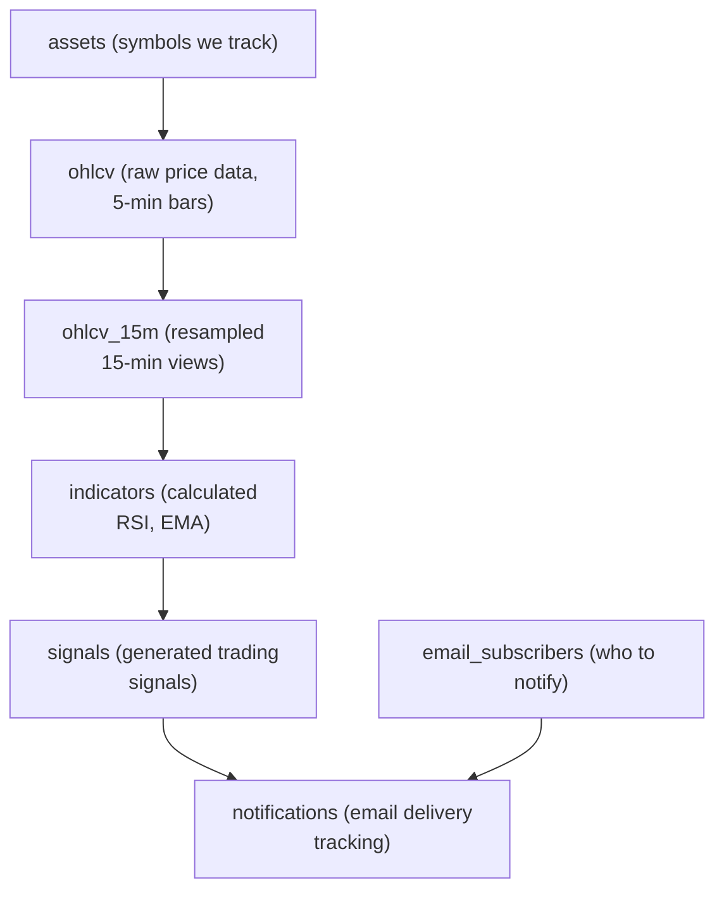

# Database Design

Complete PostgreSQL schema with explanations and rationale.

## Philosophy

**Minimal, focused schema** for MVP. Each table serves a clear purpose. No premature optimization.

## Schema Overview



## Complete Schema

```sql
-- Enable UUID extension
CREATE EXTENSION IF NOT EXISTS "pgcrypto";

-- ============================================================================
-- ASSETS TABLE
-- ============================================================================
-- Symbols we track (BTC-USD, ETH-USD only for MVP)

CREATE TABLE assets (
    id TEXT PRIMARY KEY,                    -- 'BTC-USD', 'ETH-USD'
    name TEXT NOT NULL,                     -- 'Bitcoin', 'Ethereum'
    asset_type TEXT NOT NULL DEFAULT 'crypto',
    active BOOLEAN NOT NULL DEFAULT true,
    created_at TIMESTAMPTZ NOT NULL DEFAULT NOW()
);

-- Seed data
INSERT INTO assets (id, name, asset_type) VALUES
    ('BTC-USD', 'Bitcoin', 'crypto'),
    ('ETH-USD', 'Ethereum', 'crypto');

COMMENT ON TABLE assets IS 'Crypto assets tracked by the system (MVP: 2 only)';

-- ============================================================================
-- OHLCV TABLE (5-minute raw data)
-- ============================================================================
-- Raw price data from Yahoo Finance, fetched every 5 minutes

CREATE TABLE ohlcv (
    id UUID PRIMARY KEY DEFAULT gen_random_uuid(),
    asset_id TEXT NOT NULL REFERENCES assets(id) ON DELETE CASCADE,
    timestamp TIMESTAMPTZ NOT NULL,
    open DECIMAL(20, 8) NOT NULL CHECK (open > 0),
    high DECIMAL(20, 8) NOT NULL CHECK (high > 0),
    low DECIMAL(20, 8) NOT NULL CHECK (low > 0),
    close DECIMAL(20, 8) NOT NULL CHECK (close > 0),
    volume BIGINT NOT NULL CHECK (volume >= 0),

    -- Quality metadata
    data_quality TEXT DEFAULT 'valid',      -- 'valid', 'gap', 'stale', 'spike'
    fetched_at TIMESTAMPTZ NOT NULL DEFAULT NOW(),

    UNIQUE(asset_id, timestamp)
);

CREATE INDEX idx_ohlcv_asset_time ON ohlcv(asset_id, timestamp DESC);
CREATE INDEX idx_ohlcv_quality ON ohlcv(data_quality) WHERE data_quality != 'valid';

COMMENT ON TABLE ohlcv IS '5-minute OHLCV bars from Yahoo Finance (raw, unprocessed)';
COMMENT ON COLUMN ohlcv.data_quality IS 'Quality flag: valid, gap (missing prior bar), stale (>10min old), spike (>5% jump)';

-- ============================================================================
-- OHLCV_15M TABLE (resampled 15-minute data)
-- ============================================================================
-- Resampled from ohlcv, used for indicator calculation

CREATE TABLE ohlcv_15m (
    id UUID PRIMARY KEY DEFAULT gen_random_uuid(),
    asset_id TEXT NOT NULL REFERENCES assets(id) ON DELETE CASCADE,
    timestamp TIMESTAMPTZ NOT NULL,
    open DECIMAL(20, 8) NOT NULL,
    high DECIMAL(20, 8) NOT NULL,
    low DECIMAL(20, 8) NOT NULL,
    close DECIMAL(20, 8) NOT NULL,
    volume BIGINT NOT NULL,

    -- Derived from 3x 5-minute bars
    bar_count SMALLINT NOT NULL DEFAULT 3,  -- How many 5-min bars contributed
    resampled_at TIMESTAMPTZ NOT NULL DEFAULT NOW(),

    UNIQUE(asset_id, timestamp)
);

CREATE INDEX idx_ohlcv_15m_asset_time ON ohlcv_15m(asset_id, timestamp DESC);

COMMENT ON TABLE ohlcv_15m IS '15-minute resampled bars (3x 5-min bars aggregated)';
COMMENT ON COLUMN ohlcv_15m.bar_count IS 'Number of 5-min bars used (3=complete, <3=partial/gap)';

-- ============================================================================
-- INDICATORS TABLE
-- ============================================================================
-- Calculated technical indicators (RSI, EMA12, EMA26, ADX for regime)

CREATE TABLE indicators (
    id UUID PRIMARY KEY DEFAULT gen_random_uuid(),
    asset_id TEXT NOT NULL REFERENCES assets(id) ON DELETE CASCADE,
    timestamp TIMESTAMPTZ NOT NULL,
    timeframe TEXT NOT NULL DEFAULT '15m',

    -- RSI (Relative Strength Index)
    rsi DECIMAL(5, 2) CHECK (rsi >= 0 AND rsi <= 100),

    -- EMAs for crossover
    ema_12 DECIMAL(20, 8),
    ema_26 DECIMAL(20, 8),
    ema_diff DECIMAL(20, 8),                -- ema_12 - ema_26 (positive = bullish)

    -- Regime detection (ADX or simple range index)
    adx DECIMAL(5, 2),                      -- Average Directional Index
    regime TEXT,                            -- 'trend', 'range', 'uncertain'

    calculated_at TIMESTAMPTZ NOT NULL DEFAULT NOW(),

    UNIQUE(asset_id, timestamp, timeframe)
);

CREATE INDEX idx_indicators_asset_time ON indicators(asset_id, timestamp DESC);
CREATE INDEX idx_indicators_regime ON indicators(regime);

COMMENT ON TABLE indicators IS 'Calculated technical indicators for signal generation';
COMMENT ON COLUMN indicators.ema_diff IS 'EMA12 - EMA26, positive = short above long (bullish)';
COMMENT ON COLUMN indicators.regime IS 'Market context: trend (allow EMA cross), range (allow RSI), uncertain (no signals)';

-- ============================================================================
-- SIGNALS TABLE
-- ============================================================================
-- Generated trading signals with regime logic and cooldown enforcement

CREATE TABLE signals (
    id UUID PRIMARY KEY DEFAULT gen_random_uuid(),
    asset_id TEXT NOT NULL REFERENCES assets(id) ON DELETE CASCADE,
    timeframe TEXT NOT NULL DEFAULT '15m',

    -- Signal metadata
    signaled_at TIMESTAMPTZ NOT NULL,
    rule_version TEXT NOT NULL,             -- 'rsi_mean_reversion_v1', 'ema_crossover_v1'

    -- Market context
    regime TEXT NOT NULL,                   -- 'trend', 'range'
    signal_type TEXT NOT NULL CHECK (signal_type IN ('BUY', 'HOLD')),
    strength SMALLINT NOT NULL CHECK (strength >= 0 AND strength <= 100),

    -- Explanation
    explanation TEXT NOT NULL,              -- Plain English: "RSI crossed below 30 in ranging market..."
    reasoning JSONB NOT NULL,               -- Structured data for display

    -- Prices at signal time
    price_at_signal DECIMAL(20, 8) NOT NULL,

    -- Idempotency (prevent duplicates)
    idempotency_key TEXT NOT NULL UNIQUE,  -- asset_id:timeframe:rule:signaled_at

    generated_at TIMESTAMPTZ NOT NULL DEFAULT NOW(),

    UNIQUE(asset_id, timeframe, rule_version, signaled_at)
);

CREATE INDEX idx_signals_asset_time ON signals(asset_id, signaled_at DESC);
CREATE INDEX idx_signals_strength ON signals(strength DESC) WHERE strength >= 70;
CREATE INDEX idx_signals_regime ON signals(regime);
CREATE INDEX idx_signals_recent ON signals(signaled_at DESC) WHERE signaled_at > NOW() - INTERVAL '7 days';

COMMENT ON TABLE signals IS 'Generated trading signals with regime logic (BUY or HOLD only)';
COMMENT ON COLUMN signals.idempotency_key IS 'Prevents duplicate signals if job reruns';
COMMENT ON COLUMN signals.reasoning IS 'Structured JSON: {rsi: 28, ema_cross: true, regime: "range"}';

-- ============================================================================
-- EMAIL_SUBSCRIBERS TABLE
-- ============================================================================
-- Users who signed up for email notifications (double opt-in)

CREATE TABLE email_subscribers (
    id UUID PRIMARY KEY DEFAULT gen_random_uuid(),
    email TEXT NOT NULL UNIQUE,

    -- Double opt-in flow
    confirmed BOOLEAN NOT NULL DEFAULT false,
    confirmation_token TEXT UNIQUE,
    confirmed_at TIMESTAMPTZ,

    -- Subscription status
    subscribed_at TIMESTAMPTZ NOT NULL DEFAULT NOW(),
    unsubscribed BOOLEAN NOT NULL DEFAULT false,
    unsubscribed_at TIMESTAMPTZ,
    unsubscribe_token TEXT NOT NULL UNIQUE DEFAULT encode(gen_random_bytes(32), 'hex'),

    -- Rate limiting
    last_notification_sent_at TIMESTAMPTZ,

    -- Consent tracking (GDPR/LGPD)
    consent_ip TEXT,
    consent_user_agent TEXT,

    created_at TIMESTAMPTZ NOT NULL DEFAULT NOW()
);

CREATE INDEX idx_email_subscribers_active ON email_subscribers(email)
    WHERE confirmed = true AND unsubscribed = false;
CREATE INDEX idx_email_subscribers_confirmation ON email_subscribers(confirmation_token)
    WHERE confirmation_token IS NOT NULL;

COMMENT ON TABLE email_subscribers IS 'Email subscribers with double opt-in and consent tracking';
COMMENT ON COLUMN email_subscribers.confirmed IS 'True after clicking confirmation link';

-- ============================================================================
-- NOTIFICATIONS TABLE
-- ============================================================================
-- Audit log of sent email notifications (idempotent, tracks delivery)

CREATE TABLE notifications (
    id UUID PRIMARY KEY DEFAULT gen_random_uuid(),
    signal_id UUID NOT NULL REFERENCES signals(id) ON DELETE CASCADE,

    -- Delivery details
    channel TEXT NOT NULL DEFAULT 'email',
    recipient TEXT NOT NULL,                -- Email address

    -- Email provider tracking
    provider TEXT NOT NULL DEFAULT 'resend',
    provider_message_id TEXT,               -- Resend message ID

    -- Delivery status
    sent_at TIMESTAMPTZ NOT NULL DEFAULT NOW(),
    delivered_at TIMESTAMPTZ,
    opened_at TIMESTAMPTZ,
    clicked_at TIMESTAMPTZ,
    bounced BOOLEAN DEFAULT false,
    bounce_reason TEXT,

    -- Idempotency (one notification per signal per recipient)
    UNIQUE(signal_id, channel, recipient)
);

CREATE INDEX idx_notifications_signal ON notifications(signal_id);
CREATE INDEX idx_notifications_recipient ON notifications(recipient, sent_at DESC);
CREATE INDEX idx_notifications_delivery_status ON notifications(delivered_at, opened_at, clicked_at);
CREATE INDEX idx_notifications_bounced ON notifications(bounced) WHERE bounced = true;

COMMENT ON TABLE notifications IS 'Audit log of email notifications (one per signal per recipient)';
COMMENT ON COLUMN notifications.provider_message_id IS 'Resend message ID for webhook tracking';

-- ============================================================================
-- VIEWS
-- ============================================================================

-- Recent signals with notification count
CREATE VIEW signal_summary AS
SELECT
    s.id,
    s.asset_id,
    s.signaled_at,
    s.signal_type,
    s.strength,
    s.regime,
    s.explanation,
    s.price_at_signal,
    COUNT(n.id) as notification_count,
    COUNT(n.opened_at) as opened_count,
    COUNT(n.clicked_at) as clicked_count
FROM signals s
LEFT JOIN notifications n ON n.signal_id = s.id
WHERE s.signaled_at > NOW() - INTERVAL '7 days'
GROUP BY s.id
ORDER BY s.signaled_at DESC;

COMMENT ON VIEW signal_summary IS 'Recent signals with email engagement metrics';

-- Active subscriber metrics
CREATE VIEW subscriber_metrics AS
SELECT
    COUNT(*) FILTER (WHERE confirmed = true AND unsubscribed = false) as active_subscribers,
    COUNT(*) FILTER (WHERE confirmed = false) as pending_confirmation,
    COUNT(*) FILTER (WHERE unsubscribed = true) as unsubscribed_count,
    AVG(EXTRACT(EPOCH FROM (unsubscribed_at - subscribed_at)) / 86400)::DECIMAL(10,2)
        FILTER (WHERE unsubscribed = true) as avg_days_before_unsubscribe
FROM email_subscribers;

COMMENT ON VIEW subscriber_metrics IS 'Subscriber health metrics';
```

## Key Design Decisions

### 1. Separate 5-min and 15-min Tables

**Why?**

- Raw 5-min data may have gaps or be reprocessed
- 15-min resampling is stable and used for indicators
- Can re-generate 15-min from 5-min if needed

**Trade-off:**

- More storage
- But cleaner pipeline logic

### 2. `data_quality` Column in OHLCV

**Why?**

- Flag bad data without deleting it
- Can audit failures later
- Query excludes `data_quality != 'valid'`

**Possible Values:**

- `valid` - Normal bar
- `gap` - Missing prior bar (>5 min gap)
- `stale` - Fetched >10 minutes ago
- `spike` - Price jump >5% (fat-finger check)

### 3. `regime` Column in Indicators & Signals

**Why?**

- Core to the expert feedback
- Determines which signals are allowed
- Queryable for analytics

**Calculation:**

```sql
-- Simple approach (no ADX yet)
UPDATE indicators SET regime =
    CASE
        WHEN adx > 25 THEN 'trend'
        WHEN adx < 20 THEN 'range'
        ELSE 'uncertain'
    END;
```

### 4. `idempotency_key` in Signals

**Why?**

- If Prefect job reruns, don't duplicate signals
- Format: `BTC-USD:15m:rsi_v1:2025-01-20T10:15:00Z`
- Unique constraint enforces

**Example:**

```python
idempotency_key = f"{asset_id}:{timeframe}:{rule_version}:{signaled_at.isoformat()}"
```

### 5. Double Opt-In for Email Subscribers

**Why?**

- Prevents fake signups
- Required for GDPR/LGPD compliance
- Reduces bounce rate (better deliverability)

**Flow:**

1. User enters email → `confirmed=false`, generates `confirmation_token`
2. Email sent with confirmation link
3. User clicks → `confirmed=true`, `confirmed_at` set
4. Only send signals to `confirmed=true AND unsubscribed=false`

### 6. Notification Idempotency

**Why?**

- If email job reruns, don't resend
- Unique constraint on `(signal_id, channel, recipient)`
- Safe to retry

### 7. JSONB for `reasoning` in Signals

**Why?**

- Flexible structure for display
- Can query JSON fields if needed

**Example:**

```json
{
  "rsi": 28.5,
  "rsi_threshold": 30,
  "ema_12": 42100.50,
  "ema_26": 41800.25,
  "ema_cross": true,
  "regime": "range",
  "adx": 18.2
}
```

## Data Retention

### MVP (Keep Forever)

- All tables retained indefinitely
- Small data volume (<1GB in 6 months)

### Future (Compression)

**After 90 days:**

- Compress `ohlcv` older than 90 days (TimescaleDB hypertable)
- Keep `ohlcv_15m` forever (smaller)
- Keep all `signals` forever (tiny)

**After 1 year:**

- Archive `notifications` (move to cold storage)

## Indexes Explained

### Why `asset_id, timestamp DESC`?

Most queries:

```sql
SELECT * FROM ohlcv_15m
WHERE asset_id = 'BTC-USD'
ORDER BY timestamp DESC
LIMIT 100;
```

Composite index `(asset_id, timestamp DESC)` serves this perfectly.

### Why Partial Index on `strength >= 70`?

```sql
CREATE INDEX idx_signals_strength ON signals(strength DESC)
WHERE strength >= 70;
```

- Only index strong signals (smaller index)
- Query: "Find strong signals for email"
- Don't care about weak signals (<70)

### Why Index on `data_quality != 'valid'`?

```sql
CREATE INDEX idx_ohlcv_quality ON ohlcv(data_quality)
WHERE data_quality != 'valid';
```

- Most data is valid (99%)
- Only index exceptions
- Query: "Show me bad data for debugging"

## Example Queries

### Fetch Latest 15-min Bars for Indicator Calculation

```sql
SELECT timestamp, close
FROM ohlcv_15m
WHERE asset_id = 'BTC-USD'
ORDER BY timestamp DESC
LIMIT 100;  -- Last 100 bars = 25 hours (enough for RSI-14, EMA-26)
```

### Check Cooldown Before Generating Signal

```sql
-- Has this asset had a signal in the last 8 hours?
SELECT EXISTS (
    SELECT 1
    FROM signals
    WHERE asset_id = 'BTC-USD'
      AND rule_version = 'rsi_mean_reversion_v1'
      AND signaled_at > NOW() - INTERVAL '8 hours'
) AS cooldown_active;
```

### Find Strong Signals to Email

```sql
SELECT s.id, s.asset_id, s.explanation, s.strength
FROM signals s
WHERE s.strength >= 70
  AND s.signaled_at > NOW() - INTERVAL '15 minutes'
  AND NOT EXISTS (
      SELECT 1
      FROM notifications n
      WHERE n.signal_id = s.id
  );
```

### Get Active Subscribers

```sql
SELECT email
FROM email_subscribers
WHERE confirmed = true
  AND unsubscribed = false;
```

### Calculate Email Engagement Rate

```sql
SELECT
    COUNT(*) as total_sent,
    COUNT(delivered_at) as delivered,
    COUNT(opened_at) as opened,
    COUNT(clicked_at) as clicked,
    ROUND(100.0 * COUNT(opened_at) / NULLIF(COUNT(delivered_at), 0), 2) as open_rate,
    ROUND(100.0 * COUNT(clicked_at) / NULLIF(COUNT(opened_at), 0), 2) as ctr
FROM notifications
WHERE sent_at > NOW() - INTERVAL '7 days';
```

## Migration Strategy

### Initial Setup

```bash
# Run schema
psql $DATABASE_URL < database/schema.sql

# Verify
psql $DATABASE_URL -c "\dt"  # List tables
psql $DATABASE_URL -c "SELECT * FROM assets;"
```

### Adding New Columns (Future)

```sql
-- Add ADX column to indicators
ALTER TABLE indicators ADD COLUMN adx DECIMAL(5, 2);

-- Backfill with NULL (will compute on next run)
UPDATE indicators SET adx = NULL;
```

### Adding New Indexes (Future)

```sql
-- Concurrent index (doesn't lock table)
CREATE INDEX CONCURRENTLY idx_new_column ON table_name(column_name);
```

## Backup & Recovery

### Daily Backups (Neon/Supabase)

- Automatic daily snapshots
- Point-in-time recovery (7 days)

### Manual Backup

```bash
# Dump schema + data
pg_dump $DATABASE_URL > backup.sql

# Restore
psql $NEW_DATABASE_URL < backup.sql
```

### Disaster Recovery

**If database corrupted:**

1. Restore from latest backup (RTO: 5 min)
2. Re-run Prefect jobs for last 24 hours
3. Signals regenerated, emails resent (idempotent)

## Performance Expectations

| Query | Target | Notes |
|-------|--------|-------|
| Fetch latest 100 bars | <10ms | Indexed |
| Insert new signal | <5ms | Simple insert |
| Find strong signals | <20ms | Partial index |
| Email engagement metrics | <50ms | Aggregation on 7 days |

**Stress Test:**

- 1 million OHLCV rows = ~100MB
- 10k signals = ~2MB
- 1k subscribers = <1MB

Total: <200MB after 6 months (easily within free tier).

## Schema Validation

```sql
-- Check for orphaned records
SELECT COUNT(*) FROM ohlcv WHERE asset_id NOT IN (SELECT id FROM assets);
-- Should be 0

-- Check for signals without notifications (>15 min old)
SELECT COUNT(*) FROM signals s
WHERE s.strength >= 70
  AND s.signaled_at < NOW() - INTERVAL '15 minutes'
  AND NOT EXISTS (SELECT 1 FROM notifications WHERE signal_id = s.id);
-- Should be 0 (or investigate)

-- Check for unconfirmed subscribers (>24 hours)
SELECT COUNT(*) FROM email_subscribers
WHERE confirmed = false
  AND subscribed_at < NOW() - INTERVAL '24 hours';
-- Manual cleanup if >100
```

---

**Next:** See `04-DATA-PIPELINE.md` for how this schema is populated.
