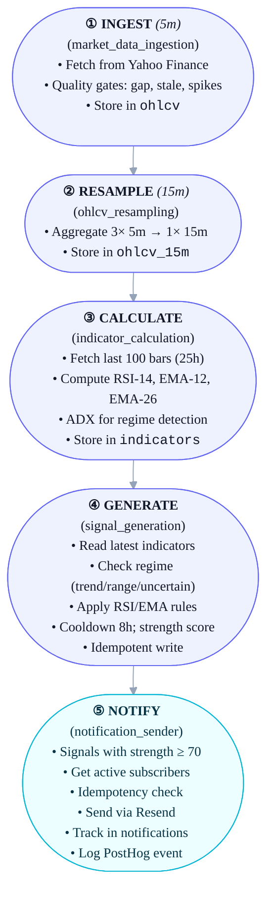

# Data Pipeline

Complete guide to the Prefect-based data pipeline with quality gates and regime detection.

## Pipeline Philosophy

**Fail fast, fail loud, don't send bad signals.**

- Fetch data every 5 minutes
- Run quality gates immediately
- Reject bad data, don't store it
- Alert on failures
- Idempotent operations (safe to retry)

## Pipeline Overview

```bash
Every 5 minutes:
┌─────────────────────────────────────────────────┐
│ 1. INGEST (market_data_ingestion)              │
│    - Fetch from Yahoo Finance                   │
│    - Quality gates (gap, stale, spike checks)   │
│    - Store in ohlcv table                       │
└─────────────────────────────────────────────────┘
                      ↓
Every 15 minutes:
┌─────────────────────────────────────────────────┐
│ 2. RESAMPLE (ohlcv_resampling)                 │
│    - Aggregate 3x 5-min bars → 1x 15-min bar    │
│    - Store in ohlcv_15m table                   │
└─────────────────────────────────────────────────┘
                      ↓
┌─────────────────────────────────────────────────┐
│ 3. CALCULATE (indicator_calculation)           │
│    - Fetch last 100 bars (25 hours)             │
│    - Calculate RSI-14, EMA-12, EMA-26           │
│    - Calculate ADX for regime detection          │
│    - Store in indicators table                   │
└─────────────────────────────────────────────────┘
                      ↓
┌─────────────────────────────────────────────────┐
│ 4. GENERATE (signal_generation)                │
│    - Read latest indicators                      │
│    - Check regime (trend/range/uncertain)        │
│    - Apply rules (RSI or EMA based on regime)    │
│    - Check cooldown (8 hours)                    │
│    - Calculate strength score                    │
│    - Store signal (idempotent)                   │
└─────────────────────────────────────────────────┘
                      ↓
┌─────────────────────────────────────────────────┐
│ 5. NOTIFY (notification_sender)                │
│    - Find signals with strength >= 70            │
│    - Get active subscribers                      │
│    - Check notification idempotency              │
│    - Send via Resend                             │
│    - Track in notifications table                │
│    - Log PostHog event                           │
└─────────────────────────────────────────────────┘
```



## Schedule

```bash
# Prefect cron schedules
SCHEDULES = {
    "market_data_ingestion": "*/5 * * * *",      # Every 5 minutes
    "ohlcv_resampling": "0,15,30,45 * * * *",    # Every 15 minutes (on the hour)
    "indicator_calculation": "2,17,32,47 * * * *", # 2 min after resample
    "signal_generation": "5,20,35,50 * * * *",   # 5 min after indicators
    "notification_sender": "7,22,37,52 * * * *", # 7 min after signals
}
```

**Timing Breakdown:**

```bash
00:00 - Ingest (5-min bar)
00:05 - Ingest
00:10 - Ingest
00:15 - Resample (create 15-min bar from 00:00, 00:05, 00:10)
00:17 - Calculate indicators
00:20 - Generate signals
00:22 - Send notifications

00:20 - Ingest (next 5-min bar)
00:25 - Ingest
00:30 - Resample (next 15-min bar)
00:32 - Calculate
00:35 - Generate
00:37 - Notify
```

## Flow 1: Market Data Ingestion

**File:** `prefect/flows/market_data_ingestion.py`

### Purpose

Fetch raw OHLCV data from Yahoo Finance every 5 minutes, run quality gates, store if valid.

### Tasks

```python
@task(name="fetch-yahoo-finance", retries=3, retry_delay_seconds=60)
def fetch_ohlcv(asset_id: str) -> pd.DataFrame:
    """
    Fetch 5-minute OHLCV data from Yahoo Finance.

    Args:
        asset_id: 'BTC-USD' or 'ETH-USD'

    Returns:
        DataFrame with columns: timestamp, open, high, low, close, volume

    Raises:
        ValueError: If no data returned or API error
    """
    import yfinance as yf

    ticker = yf.Ticker(asset_id)

    # Fetch last 1 hour of 5-min data (safety margin)
    df = ticker.history(period="1h", interval="5m")

    if df.empty:
        raise ValueError(f"No data returned for {asset_id}")

    # Format for our schema
    df = df.reset_index()
    df = df.rename(columns={
        "Datetime": "timestamp",
        "Open": "open",
        "High": "high",
        "Low": "low",
        "Close": "close",
        "Volume": "volume"
    })

    return df[["timestamp", "open", "high", "low", "close", "volume"]]


@task(name="quality-gate-check")
def quality_gate(df: pd.DataFrame, asset_id: str) -> tuple[pd.DataFrame, str]:
    """
    Run quality checks on fetched data.

    Quality checks:
    1. Gap check: Is there a 5-min bar immediately before this?
    2. Staleness check: Is data <10 minutes old?
    3. Spike check: Did price jump >5% from prior close?

    Returns:
        (df, quality_status) where quality_status is 'valid', 'gap', 'stale', or 'spike'
    """
    # Get latest bar
    latest = df.iloc[-1]

    quality = "valid"

    # 1. Gap check (fetch prior bar from DB)
    prior_close = get_prior_close(asset_id, latest["timestamp"])
    if prior_close is None:
        quality = "gap"
        logger.warning(f"{asset_id}: Gap detected, no prior bar")

    # 2. Staleness check
    age_minutes = (datetime.now(timezone.utc) - latest["timestamp"]).total_seconds() / 60
    if age_minutes > 10:
        quality = "stale"
        logger.warning(f"{asset_id}: Stale data ({age_minutes:.1f} min old)")

    # 3. Spike check (fat-finger detection)
    if prior_close:
        price_change_pct = abs((latest["close"] - prior_close) / prior_close * 100)
        if price_change_pct > 5:
            quality = "spike"
            logger.warning(f"{asset_id}: Price spike detected ({price_change_pct:.1f}%)")

    return df, quality


@task(name="store-ohlcv")
def store_ohlcv(df: pd.DataFrame, asset_id: str, quality: str):
    """
    Store OHLCV data in database.

    Uses INSERT ... ON CONFLICT DO UPDATE for idempotency.
    """
    from sqlalchemy import create_engine

    engine = create_engine(os.getenv("DATABASE_URL"))

    # Add metadata columns
    df["asset_id"] = asset_id
    df["data_quality"] = quality
    df["fetched_at"] = datetime.now(timezone.utc)

    # Upsert (idempotent)
    df.to_sql(
        "ohlcv",
        engine,
        if_exists="append",
        index=False,
        method="multi"
    )

    logger.info(f"Stored {len(df)} bars for {asset_id} (quality: {quality})")


@flow(name="market-data-ingestion")
def market_data_ingestion_flow(assets: list[str] = ["BTC-USD", "ETH-USD"]):
    """
    Main flow: Ingest OHLCV data for all assets.

    Runs every 5 minutes.
    """
    for asset_id in assets:
        try:
            # Fetch data
            df = fetch_ohlcv(asset_id)

            # Run quality gates
            df, quality = quality_gate(df, asset_id)

            # Store (even if quality != 'valid', for debugging)
            store_ohlcv(df, asset_id, quality)

            # Alert if bad quality
            if quality != "valid":
                alert_ops(f"{asset_id}: Data quality issue ({quality})")

        except Exception as e:
            logger.error(f"Failed to ingest {asset_id}: {e}")
            alert_ops(f"{asset_id} ingestion failed: {e}")
            # Don't raise - continue with other assets
```

### Quality Gates Explained

1. **Gap Check**

   - Expected: New bar every 5 minutes
   - If missing: Market may be closed (shouldn't happen for crypto), or Yahoo Finance issue
   - Action: Flag as `gap`, alert ops

2. **Staleness Check**

   - Expected: Data fetched within 10 minutes of current time
   - If stale: Clock sync issue or Yahoo Finance delay
   - Action: Flag as `stale`, alert ops

3. **Spike Check (Fat-Finger Detection)**

   - Expected: Price changes <5% per 5-min bar (crypto is volatile but not THAT volatile)
   - If spike: Data error, flash crash, or API bug
   - Action: Flag as `spike`, alert ops, don't use for signals

### Error Handling

```python
# Retry logic (3 attempts with 60s delay)
@task(retries=3, retry_delay_seconds=60)
def fetch_ohlcv(asset_id: str):
    # If Yahoo Finance times out, retry automatically
    pass

# Circuit breaker (stop if failing repeatedly)
@flow
def market_data_ingestion_flow():
    failure_count = get_recent_failure_count()
    if failure_count >= 2:
        alert_ops("CRITICAL: Data ingestion failing repeatedly")
        trigger_kill_switch()
        return  # Stop processing
```

## Flow 2: OHLCV Resampling

**File:** `prefect/flows/ohlcv_resampling.py`

- **Purpose**

Aggregate 3x 5-minute bars into 1x 15-minute bar for indicator calculation.

### Why Separate Flow?

- Indicators need stable 15-min bars
- Don't recalculate if raw 5-min data is patched
- Clear separation of concerns

### Task

```python
@task(name="resample-to-15m")
def resample_to_15m(asset_id: str):
    """
    Resample last 3x 5-min bars to 1x 15-min bar.

    OHLC aggregation:
    - Open: First bar's open
    - High: Max of 3 highs
    - Low: Min of 3 lows
    - Close: Last bar's close
    - Volume: Sum of 3 volumes
    """
    from sqlalchemy import create_engine

    engine = create_engine(os.getenv("DATABASE_URL"))

    # Fetch last 3x 5-min bars (only 'valid' quality)
    query = f"""
        SELECT timestamp, open, high, low, close, volume
        FROM ohlcv
        WHERE asset_id = '{asset_id}'
          AND data_quality = 'valid'
        ORDER BY timestamp DESC
        LIMIT 3
    """

    df = pd.read_sql(query, engine)

    if len(df) < 3:
        logger.warning(f"{asset_id}: Not enough bars for resampling ({len(df)}/3)")
        return

    # Resample
    resampled = {
        "asset_id": asset_id,
        "timestamp": df.iloc[0]["timestamp"],  # Latest timestamp
        "open": df.iloc[-1]["open"],           # First bar's open
        "high": df["high"].max(),
        "low": df["low"].min(),
        "close": df.iloc[0]["close"],          # Last bar's close
        "volume": df["volume"].sum(),
        "bar_count": len(df),
        "resampled_at": datetime.now(timezone.utc)
    }

    # Upsert into ohlcv_15m
    insert_query = """
        INSERT INTO ohlcv_15m (asset_id, timestamp, open, high, low, close, volume, bar_count, resampled_at)
        VALUES (:asset_id, :timestamp, :open, :high, :low, :close, :volume, :bar_count, :resampled_at)
        ON CONFLICT (asset_id, timestamp) DO UPDATE SET
            open = EXCLUDED.open,
            high = EXCLUDED.high,
            low = EXCLUDED.low,
            close = EXCLUDED.close,
            volume = EXCLUDED.volume,
            bar_count = EXCLUDED.bar_count,
            resampled_at = EXCLUDED.resampled_at
    """

    with engine.connect() as conn:
        conn.execute(insert_query, resampled)
        conn.commit()

    logger.info(f"Resampled {asset_id} to 15-min bar")


@flow(name="ohlcv-resampling")
def ohlcv_resampling_flow(assets: list[str] = ["BTC-USD", "ETH-USD"]):
    """
    Runs every 15 minutes (on the hour: :00, :15, :30, :45).
    """
    for asset_id in assets:
        resample_to_15m(asset_id)
```

## Flow 3: Indicator Calculation

**File:** `prefect/flows/indicator_calculation.py`

- **Purpose**

Calculate RSI-14, EMA-12, EMA-26, and ADX for regime detection from 15-min bars.

- **Tasks**

```python
@task(name="fetch-15m-bars")
def fetch_bars(asset_id: str, limit: int = 100) -> pd.DataFrame:
    """
    Fetch last 100x 15-min bars (25 hours of data).

    Enough for:
    - RSI-14 (needs 14+ bars)
    - EMA-26 (needs 26+ bars)
    - ADX-14 (needs 14+ bars)
    """
    from sqlalchemy import create_engine

    engine = create_engine(os.getenv("DATABASE_URL"))

    query = f"""
        SELECT timestamp, close
        FROM ohlcv_15m
        WHERE asset_id = '{asset_id}'
        ORDER BY timestamp DESC
        LIMIT {limit}
    """

    df = pd.read_sql(query, engine)
    df = df.sort_values("timestamp")  # Oldest first for calculation

    return df


@task(name="calculate-rsi")
def calculate_rsi(df: pd.DataFrame, period: int = 14) -> pd.Series:
    """
    Calculate RSI-14.

    Formula:
        RSI = 100 - (100 / (1 + RS))
        where RS = avg_gain / avg_loss over 14 periods
    """
    from data_science.indicators import calculate_rsi

    return calculate_rsi(df, period=period, price_column="close")


@task(name="calculate-ema")
def calculate_ema(df: pd.DataFrame, period: int) -> pd.Series:
    """
    Calculate EMA (Exponential Moving Average).
    """
    return df["close"].ewm(span=period, adjust=False).mean()


@task(name="calculate-adx")
def calculate_adx(df: pd.DataFrame, period: int = 14) -> pd.Series:
    """
    Calculate ADX (Average Directional Index) for regime detection.

    ADX > 25 = Trending market
    ADX < 20 = Ranging market
    """
    # TODO: Implement ADX calculation
    # For MVP, can use simple volatility proxy:
    # rolling_std / rolling_mean (coefficient of variation)
    pass


@task(name="detect-regime")
def detect_regime(adx: float) -> str:
    """
    Determine market regime from ADX.

    Rules:
    - ADX > 25: 'trend' (allow EMA crossover signals)
    - ADX < 20: 'range' (allow RSI mean-reversion signals)
    - 20 <= ADX <= 25: 'uncertain' (no signals)
    """
    if adx > 25:
        return "trend"
    elif adx < 20:
        return "range"
    else:
        return "uncertain"


@task(name="store-indicators")
def store_indicators(asset_id: str, timestamp: datetime, indicators: dict):
    """
    Store calculated indicators in database.
    """
    from sqlalchemy import create_engine

    engine = create_engine(os.getenv("DATABASE_URL"))

    insert_query = """
        INSERT INTO indicators (asset_id, timestamp, timeframe, rsi, ema_12, ema_26, ema_diff, adx, regime)
        VALUES (:asset_id, :timestamp, '15m', :rsi, :ema_12, :ema_26, :ema_diff, :adx, :regime)
        ON CONFLICT (asset_id, timestamp, timeframe) DO UPDATE SET
            rsi = EXCLUDED.rsi,
            ema_12 = EXCLUDED.ema_12,
            ema_26 = EXCLUDED.ema_26,
            ema_diff = EXCLUDED.ema_diff,
            adx = EXCLUDED.adx,
            regime = EXCLUDED.regime,
            calculated_at = NOW()
    """

    with engine.connect() as conn:
        conn.execute(insert_query, {
            "asset_id": asset_id,
            "timestamp": timestamp,
            **indicators
        })
        conn.commit()


@flow(name="indicator-calculation")
def indicator_calculation_flow(assets: list[str] = ["BTC-USD", "ETH-USD"]):
    """
    Calculate indicators for all assets.

    Runs 2 minutes after resampling (every 15 min).
    """
    for asset_id in assets:
        # Fetch bars
        df = fetch_bars(asset_id, limit=100)

        if len(df) < 26:
            logger.warning(f"{asset_id}: Not enough bars for EMA-26 ({len(df)}/26)")
            continue

        # Calculate indicators
        rsi = calculate_rsi(df, period=14)
        ema_12 = calculate_ema(df, period=12)
        ema_26 = calculate_ema(df, period=26)
        ema_diff = ema_12 - ema_26
        adx = calculate_adx(df, period=14)

        # Detect regime
        regime = detect_regime(adx.iloc[-1])

        # Store
        indicators = {
            "rsi": float(rsi.iloc[-1]),
            "ema_12": float(ema_12.iloc[-1]),
            "ema_26": float(ema_26.iloc[-1]),
            "ema_diff": float(ema_diff.iloc[-1]),
            "adx": float(adx.iloc[-1]),
            "regime": regime
        }

        store_indicators(asset_id, df.iloc[-1]["timestamp"], indicators)

        logger.info(f"{asset_id}: Indicators calculated (regime: {regime})")
```

## Flow 4: Signal Generation

**File:** `prefect/flows/signal_generation.py`

See `06-SIGNAL-GENERATION.md` for complete details on regime logic and rules.

## Flow 5: Notification Sender

**File:** `prefect/flows/notification_sender.py`

See `11-MONITORING.md` for email delivery details.

## Deployment

```bash
cd prefect

# Log in to Prefect Cloud
prefect cloud login

# Deploy all flows
python schedules.py
```

**schedules.py:**

```python
from prefect.deployments import Deployment
from prefect.server.schemas.schedules import CronSchedule

# Deploy each flow with its cron schedule
for flow_name, cron in SCHEDULES.items():
    deployment = Deployment.build_from_flow(
        flow=globals()[f"{flow_name}_flow"],
        name=f"{flow_name}-production",
        schedule=CronSchedule(cron=cron),
        work_queue_name="default"
    )
    deployment.apply()
```

---

**Next:** See `06-SIGNAL-GENERATION.md` for regime-based signal logic.
