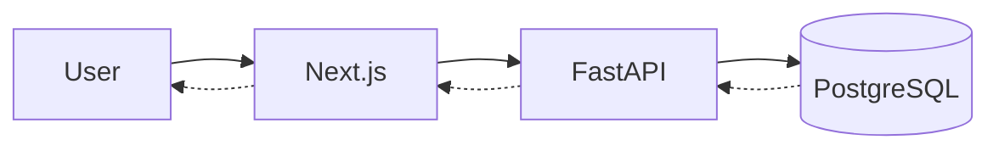
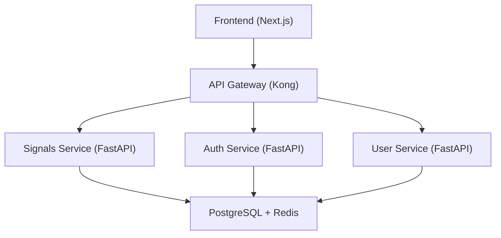
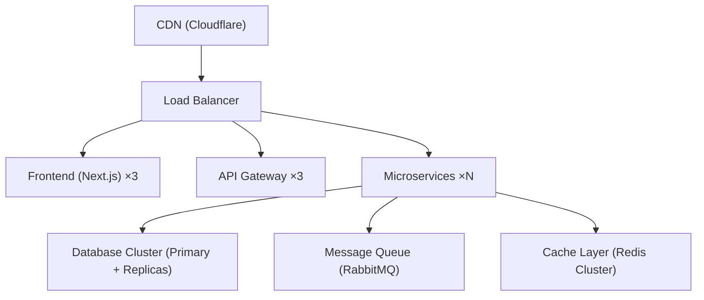

# Architecture & Design Decisions

Technical architecture and rationale for the Trading Signals MVP.

## System Overview

```bash
┌─────────────────────────────────────────────────────────────┐
│                       PRESENTATION                           │
│  Next.js 15 Frontend (Vercel)                               │
│  - Server Components for SEO                                 │
│  - Client Components for interactivity                       │
│  - Chart.js for visualizations                               │
└─────────────────┬───────────────────────────────────────────┘
                  │ HTTPS
┌─────────────────▼───────────────────────────────────────────┐
│                    APPLICATION                               │
│  FastAPI Backend (Vercel Serverless)                        │
│  - REST API endpoints                                        │
│  - Pydantic validation                                       │
│  - SQLAlchemy ORM                                            │
└─────────────────┬───────────────────────────────────────────┘
                  │
┌─────────────────▼───────────────────────────────────────────┐
│                      DATABASE                                │
│  PostgreSQL 15 (Neon)                                       │
│  - ACID guarantees                                           │
│  - Indexed queries                                           │
│  - 30-day data retention                                     │
└──────────────────────────────────────────────────────────────┘
                  ▲
┌─────────────────┴───────────────────────────────────────────┐
│                   DATA PIPELINE                              │
│  Prefect 2.x (Prefect Cloud)                                │
│  - Scheduled workflows (hourly)                              │
│  - Error handling & retries                                  │
│  - Task orchestration                                        │
└──────────────────────────────────────────────────────────────┘
```

## Technology Choices

### Frontend: Next.js 15

**Why Next.js?**

- **SEO optimization** - Server-side rendering for landing page
- **Fast development** - React + TypeScript + Tailwind
- **Vercel deployment** - Zero-config deployments
- **API routes** - Could add Next.js API routes if needed

**Why Not?**

- ❌ Create React App - No SSR, worse SEO
- ❌ Vue/Svelte - Team familiarity with React
- ❌ Plain HTML/CSS - Too slow for complex UI

### Backend: FastAPI

**Why FastAPI?**

- **Fast** - Async support for concurrent requests
- **Auto-validation** - Pydantic schemas
- **Auto-docs** - Swagger UI out of the box
- **Type safety** - Python type hints
- **Vercel compatible** - Serverless functions

**Why Not?**

- ❌ Django REST Framework - Too heavy for MVP
- ❌ Flask - No async, no auto-validation
- ❌ Express.js - Python better for data science

### Database: PostgreSQL

**Why PostgreSQL?**

- **Relational** - Clear schema for time-series data
- **ACID guarantees** - Data integrity
- **JSON support** - For `reasoning` arrays
- **Mature ecosystem** - ORMs, tools, extensions
- **Free tier** - Neon offers 0.5GB free

**Why Not?**

- ❌ MongoDB - Overkill for structured data
- ❌ MySQL - PostgreSQL has better JSON support
- ❌ SQLite - Not suitable for production

### Data Pipeline: Prefect

**Why Prefect?**

- **Workflow orchestration** - DAG-based tasks
- **Error handling** - Automatic retries
- **Scheduling** - Cron schedules
- **Monitoring** - Built-in dashboard
- **Free tier** - 20k task runs/month

**Why Not?**

- ❌ Airflow - Too complex for MVP
- ❌ Celery - Requires Redis/RabbitMQ
- ❌ Cron jobs - No monitoring, hard to debug

### Email: Resend

**Why Resend?**

- **Simple API** - Easy integration
- **Generous free tier** - 3,000 emails/month
- **Good deliverability** - Modern ESP
- **Developer-friendly** - Great docs

**Why Not?**

- ❌ SendGrid - Complex pricing
- ❌ Mailgun - Worse free tier
- ❌ AWS SES - Requires AWS account setup

## Design Patterns

### Backend: Repository Pattern

```python
# models.py - ORM models
class Signal(Base):
    __tablename__ = "signals"
    # ...

# routers/signals.py - API endpoints
@router.get("/api/signals")
def get_signals(db: Session):
    return db.query(Signal).all()
```

**Benefits:**

- Separation of concerns
- Testable business logic
- Swappable data layer

### Frontend: Component Composition

```tsx
<Dashboard>
  <SignalCard symbol="BTC-USD" />
  <SignalCard symbol="ETH-USD" />
  <SignalCard symbol="TSLA" />
</Dashboard>
```

**Benefits:**

- Reusable components
- Easy to test
- Clear hierarchy

### Data Science: Pure Functions

```python
def calculate_rsi(df: pd.DataFrame) -> pd.Series:
    # Pure function: same input -> same output
    # No side effects
    # Easy to test
    pass
```

**Benefits:**

- Testable without database
- Cacheable results
- No hidden dependencies

## Data Flow

### Hourly Cycle

```bash
00:00 - Market Data Ingestion
  ├─ Fetch OHLCV from Yahoo Finance
  ├─ Validate data quality
  └─ Store in market_data table

00:10 - Indicator Calculation
  ├─ Read last 30 days of market_data
  ├─ Calculate RSI (14-period)
  ├─ Calculate MACD (12, 26, 9)
  └─ Store in indicators table

00:15 - Signal Generation
  ├─ Read latest indicators
  ├─ Apply trading rules
  ├─ Calculate signal strength
  └─ Store in signals table

00:20 - Notification Sender
  ├─ Find signals with strength > 70
  ├─ Get active subscribers
  ├─ Check rate limits (1 email/6hrs)
  └─ Send via Resend API
```

### Request Flow



1. User visits dashboard
2. Next.js component calls `useSignals()` hook
3. Hook fetches from `/api/signals`
4. FastAPI queries database
5. Response flows back to user

## Scalability Considerations

### Current Limitations (MVP)

- ❌ No caching
- ❌ No connection pooling
- ❌ No load balancing
- ❌ No CDN
- ❌ Synchronous database queries

### Future Improvements

1. **Optimize (100+ users)**

   - Add Redis caching
   - Use PostgreSQL connection pooling
   - Add database indexes
   - Implement CDN (Vercel Edge)

2. **Scale (1,000+ users)**

   - Add read replicas
   - Implement WebSocket for real-time updates
   - Use background jobs for heavy tasks
   - Add API rate limiting

3. **Distribute (10,000+ users)**

   - Microservices architecture
   - Message queue (RabbitMQ/Kafka)
   - Separate read/write databases
   - Multi-region deployment

## Security Considerations

### MVP Security

✅ **Implemented:**

- HTTPS via Vercel
- SQL injection protection (SQLAlchemy ORM)
- Input validation (Pydantic)
- CORS restrictions

⚠️ **Not Implemented (future):**

- Authentication
- API rate limiting
- DDoS protection
- Encryption at rest

### Future Security

1. **Add Authentication**

   - JWT tokens
   - OAuth2 (Google, GitHub)
   - Email verification

2. **Enhance Security**

   - 2FA
   - API keys per user
   - Audit logs
   - Encryption at rest

## Monitoring & Observability

### MVP Monitoring

- ✅ Prefect dashboard (flow runs)
- ✅ Vercel deployment logs
- ✅ PostHog analytics (user events)

### Future Monitoring

- Error tracking (Sentry)
- Performance monitoring (Datadog)
- Custom dashboards (Grafana)
- Alerting (PagerDuty)

## Cost Analysis

### MVP Cost: **$0/month**

All services have generous free tiers suitable for MVP validation.

### Scaling Costs

**100 users/day:**

- Still $0/month (within free tiers)

**1,000 users/day:**

- Neon: $19/mo (Pro plan)
- Resend: $20/mo (50k emails)
- **Total: $39/month**

**10,000 users/day:**

- Neon: $69/mo (Scale plan)
- Vercel: $20/mo (Pro plan)
- Resend: $80/mo (200k emails)
- Prefect: $450/mo (Standard)
- **Total: $619/month**

## Trade-offs

### What We Sacrificed for Speed

1. **No authentication** - Faster MVP launch
2. **Hourly updates** - Simpler than real-time
3. **3 symbols only** - Focused validation
4. **No mobile app** - Web-first approach
5. **No backtesting** - Core features first

### What We Kept

1. **Type safety** - TypeScript + Python types
2. **Data quality** - Validation everywhere
3. **Monitoring** - Prefect + PostHog
4. **Scalability** - Architecture supports growth

## Future Architecture Evolution

### Phase 2: Product-Market Fit



### Phase 3: Scale



## Conclusion

This architecture is designed for:

- ✅ **Fast MVP development** - < 4 weeks
- ✅ **Low cost** - $0/month initially
- ✅ **Easy maintenance** - Managed services
- ✅ **Future scalability** - Can grow to 10k+ users

Trade-offs are intentional to validate the core hypothesis quickly.
