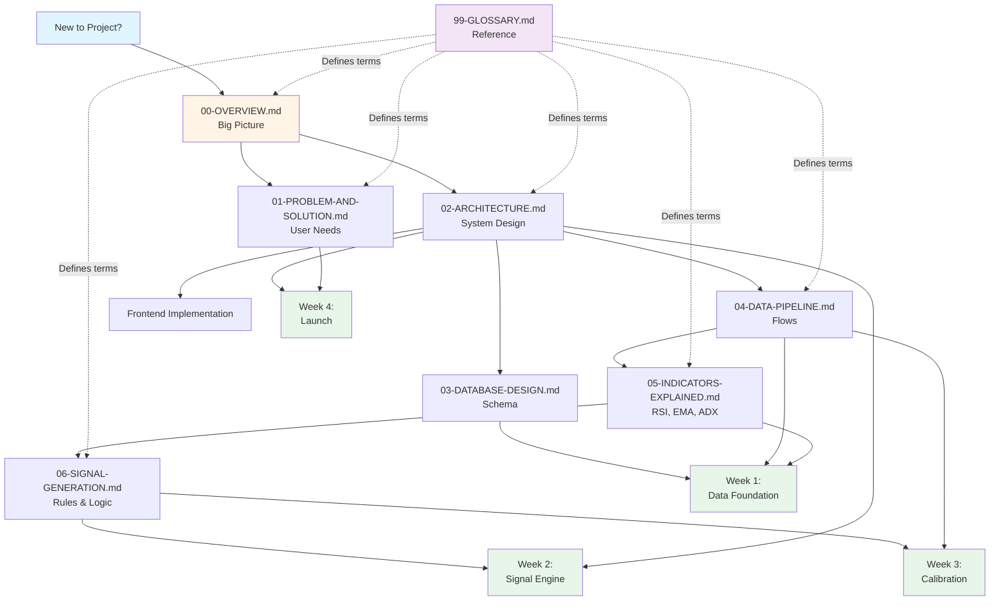

# Documentation Index

## Trading Signals MVP - Your Complete Implementation Guide

This index ties together all documentation for the Trading Signals MVP project. Whether you're implementing features, understanding the system, or debugging issues, start here.

---

## 📚 Documentation Overview

We've organized documentation into focused documents, each serving a specific purpose:

| Doc | Purpose | When to Read | Key Takeaways |
|-----|---------|--------------|---------------|
| **00-OVERVIEW.md** | Refined MVP scope with expert feedback | First read for big picture | Crypto only, 15-min bars, regime detection, quality gates |
| **01-PROBLEM-AND-SOLUTION.md** | User personas, pain points, value prop | Before building features | Who we're building for (Maria, Carlos, James), competitive positioning |
| **02-ARCHITECTURE.md** | System design, data flows, tech choices | When understanding how pieces connect | 5 Prefect flows, API endpoints, deployment strategy |
| **03-DATABASE-DESIGN.md** | Complete PostgreSQL schema | When setting up database | Separate 5-min/15-min tables, idempotency keys, quality flags |
| **04-DATA-PIPELINE.md** | Prefect-based pipeline with quality gates | When building data ingestion | 5-flow cascade, timing, quality gate implementation |
| **05-INDICATORS-EXPLAINED.md** | Deep dive into RSI, EMA, ADX | When implementing indicators | When each indicator works, common mistakes |
| **06-SIGNAL-GENERATION.md** | Regime-based signal rules | When building signal logic | Regime detection, cooldowns, idempotency, strength calculation |
| **99-GLOSSARY.md** | Comprehensive terms and definitions | When you encounter unfamiliar terms | Trading terms, system terms, user experience metrics |

---

## 🚀 Quick Start Guide

### New to the Project?

**Read in this order:**

1. **00-OVERVIEW.md** (15 min) - Get the big picture
   - What are we building? (BTC/ETH signals for busy professionals)
   - Why these choices? (Crypto only, 15-min bars, regime detection)
   - What's in/out of scope? (No stocks, no MACD, email only)

2. **01-PROBLEM-AND-SOLUTION.md** (20 min) - Understand the users
   - Meet Maria (busy professional), Carlos (swing trader), James (cautious investor)
   - Why existing solutions fail (alert fatigue, black boxes, no context)
   - Our differentiation (regime-aware, educational, transparent)

3. **02-ARCHITECTURE.md** (30 min) - See how it all connects
   - 5 Prefect flows (ingest → resample → indicators → signals → notify)
   - FastAPI endpoints (signals, market data, subscriptions)
   - Next.js frontend (landing page, dashboard, signal details)
   - Deployment (Vercel, Prefect Cloud, Neon/Supabase)

4. **05-INDICATORS-EXPLAINED.md** (25 min) - Understand the math
   - RSI: When oversold/overbought matters (ranging markets)
   - EMA: How crossovers work (trending markets)
   - ADX: Detecting regime (trend vs range vs uncertain)

5. **06-SIGNAL-GENERATION.md** (25 min) - See the logic
   - Regime-based rules (EMA in trends, RSI in ranges)
   - Cooldowns (8 hours per asset per rule)
   - Strength calculation (0-100 confidence score)
   - Plain English explanations

**Total:** ~2 hours to understand the entire system

---

### Ready to Implement?

Follow the **4-Week Plan** from 00-OVERVIEW.md:

#### Week 1: Data Foundation

**Goal:** Store validated OHLCV and indicators in PostgreSQL

**Docs to read:**

1. **03-DATABASE-DESIGN.md** - Schema, migrations, seed data
2. **04-DATA-PIPELINE.md** - Flows 1-3 (ingestion, resampling, indicators)
3. **05-INDICATORS-EXPLAINED.md** - RSI, EMA, ADX calculations

**Tasks:**

- [ ] Set up PostgreSQL database (Neon or Supabase)
- [ ] Run schema migrations (`database/schema.sql`)
- [ ] Implement Flow 1: Market Data Ingestion (Yahoo Finance + quality gates)
- [ ] Implement Flow 2: OHLCV Resampling (3x 5-min → 1x 15-min)
- [ ] Implement Flow 3: Indicator Calculation (RSI + EMA + ADX)
- [ ] Verify: Can query indicators in database for BTC/ETH

**Milestone:** `SELECT * FROM indicators WHERE asset_id = 'BTC-USD'` returns valid data

---

#### Week 2: Signal Engine + Email

**Goal:** Generate signals and send email notifications

**Docs to read:**

1. **06-SIGNAL-GENERATION.md** - Regime rules, cooldowns, idempotency
2. **02-ARCHITECTURE.md** - Resend integration, email templates
3. **01-PROBLEM-AND-SOLUTION.md** - Plain English explanations

**Tasks:**

- [ ] Implement Flow 4: Signal Generation (regime-based rules)
- [ ] Implement cooldown enforcement (8-hour window)
- [ ] Implement idempotency checks (prevent duplicates)
- [ ] Set up Resend account and configure DKIM/SPF/DMARC
- [ ] Create email templates (signal notification, confirmation, welcome)
- [ ] Implement Flow 5: Notification Sender
- [ ] Implement double opt-in flow (subscribe → confirm → welcome)
- [ ] Set up PostHog event tracking

**Milestone:** Send test email with real BTC signal to your own address

---

#### Week 3: Calibration + Safety

**Goal:** Tune parameters and add safety nets

**Docs to read:**

1. **06-SIGNAL-GENERATION.md** - Micro-backtest approach
2. **04-DATA-PIPELINE.md** - Quality gates, kill switch
3. **02-ARCHITECTURE.md** - Monitoring, alerts, runbook

**Tasks:**

- [ ] Run micro-backtest on last 90 days (per asset)
- [ ] Tune strength threshold (target: 70+ for emails)
- [ ] Tune cooldown period (6h vs 8h vs 12h)
- [ ] Implement global kill switch (env var: `SIGNALS_ENABLED`)
- [ ] Set up alert system (Slack/email for ops issues)
- [ ] Write runbook documentation (how to handle common issues)
- [ ] Test fat-finger rejection (simulate >5% spike)
- [ ] Test staleness rejection (simulate old data)

**Milestone:** System runs autonomously for 24 hours with valid signals

---

#### Week 4: Frontend + Launch

**Goal:** Public dashboard and first 100 users

**Docs to read:**

1. **02-ARCHITECTURE.md** - Frontend components, API integration
2. **01-PROBLEM-AND-SOLUTION.md** - Landing page copy, value prop
3. **00-OVERVIEW.md** - Success metrics, go-to-market

**Tasks:**

- [ ] Build landing page (hero, latest signals, email signup, FAQ)
- [ ] Build dashboard (signal grid, filters, charts)
- [ ] Build signal detail page (chart with indicators, reasoning, education)
- [ ] Connect frontend to FastAPI backend
- [ ] Deploy frontend to Vercel
- [ ] Deploy backend to Vercel (or separate hosting)
- [ ] Seed initial users (friends, Twitter followers)
- [ ] Send first real signals
- [ ] Monitor metrics (activation, engagement, fatigue, data health)

**Milestone:** 100 confirmed email subscribers, measure core metrics

---

## 🎯 Reading Paths by Role

### For Product Managers

**Goal:** Understand user needs, scope, and success metrics

1. **01-PROBLEM-AND-SOLUTION.md** - User personas, competitive analysis
2. **00-OVERVIEW.md** - MVP scope, success criteria, go-to-market
3. **02-ARCHITECTURE.md** - High-level system design

**Skip:** Technical implementation details (04, 05, 06)

---

### For Backend Engineers

**Goal:** Implement data pipeline and API

1. **00-OVERVIEW.md** - Big picture (15 min)
2. **03-DATABASE-DESIGN.md** - Schema design
3. **04-DATA-PIPELINE.md** - Prefect flows
4. **05-INDICATORS-EXPLAINED.md** - RSI, EMA, ADX code
5. **06-SIGNAL-GENERATION.md** - Signal rules
6. **02-ARCHITECTURE.md** - FastAPI endpoints, deployment

**Focus:** Prefect flows, FastAPI, PostgreSQL, Resend integration

---

### For Frontend Engineers

**Goal:** Build dashboard and landing page

1. **00-OVERVIEW.md** - Big picture (15 min)
2. **01-PROBLEM-AND-SOLUTION.md** - User personas, value prop
3. **02-ARCHITECTURE.md** - API endpoints, component structure
4. **99-GLOSSARY.md** - Terms for UI copy (signal, strength, regime)

**Focus:** Next.js pages, API integration, charts, email signup form

---

### For Data Scientists

**Goal:** Understand and tune indicators

1. **05-INDICATORS-EXPLAINED.md** - RSI, EMA, ADX deep dive
2. **06-SIGNAL-GENERATION.md** - Signal rules, strength calculation
3. **04-DATA-PIPELINE.md** - Quality gates, resampling
4. **03-DATABASE-DESIGN.md** - Indicator storage

**Focus:** Indicator calculations, micro-backtesting, parameter tuning

---

### For QA/Testers

**Goal:** Test system behavior and edge cases

1. **00-OVERVIEW.md** - What we're building
2. **04-DATA-PIPELINE.md** - Quality gates (gap, stale, spike)
3. **06-SIGNAL-GENERATION.md** - Cooldowns, idempotency
4. **02-ARCHITECTURE.md** - API endpoints, email flows

**Test scenarios:**

- Missing data (gap check)
- Old data (staleness check)
- Price spike >5% (fat-finger check)
- Duplicate signal prevention (idempotency)
- Cooldown enforcement (no signal within 8 hours)
- Double opt-in flow (subscribe → confirm → welcome)
- Unsubscribe flow (one-click)

---

## 🔍 Quick Reference: Where to Find X

### "How do I...?"

| Task | Document | Section |
|------|----------|---------|
| Set up the database | 03-DATABASE-DESIGN.md | Setup Instructions |
| Fetch data from Yahoo Finance | 04-DATA-PIPELINE.md | Flow 1: Market Data Ingestion |
| Calculate RSI | 05-INDICATORS-EXPLAINED.md | RSI Calculation |
| Detect market regime | 05-INDICATORS-EXPLAINED.md | ADX and Regime Detection |
| Generate a signal | 06-SIGNAL-GENERATION.md | Signal Generation Logic |
| Prevent duplicate signals | 06-SIGNAL-GENERATION.md | Idempotency |
| Send email notifications | 02-ARCHITECTURE.md | Flow 5: Notification Sender |
| Add a new indicator | 05-INDICATORS-EXPLAINED.md | (Extend existing patterns) |
| Add a new asset | 03-DATABASE-DESIGN.md | Insert into `assets` table |
| Tune signal thresholds | 06-SIGNAL-GENERATION.md | Calibration and Tuning |
| Handle missing data | 04-DATA-PIPELINE.md | Quality Gates |
| Deploy to production | 02-ARCHITECTURE.md | Deployment Architecture |
| Monitor system health | 02-ARCHITECTURE.md | Monitoring and Alerts |
| Understand a term | 99-GLOSSARY.md | (Search for term) |

---

### "What does this term mean?"

| Term | Glossary Section | Related Docs |
|------|------------------|--------------|
| Regime | Market Regime Terms | 05, 06 |
| RSI | Indicator Terms | 05 |
| EMA | Indicator Terms | 05 |
| ADX | Trading Terms | 05 |
| Signal Strength | Signal Terms | 06 |
| Cooldown | Signal Terms | 06 |
| Idempotency | Signal Terms | 06 |
| Quality Gates | Data Terms | 04 |
| OHLCV | Data Terms | 03, 04 |
| Prefect Flow | System Terms | 02, 04 |
| Double Opt-In | System Terms | 02 |
| Activation Rate | User Experience Terms | 00, 01 |

---

## 📊 Document Relationships



---

## 🧭 Navigating Complex Topics

### Understanding Regime Detection

**Reading path:**

1. **05-INDICATORS-EXPLAINED.md** → ADX and Regime Detection section
   - Learn how ADX measures trend strength
   - See thresholds: ADX >25 (trend), ADX <20 (range), 20-25 (uncertain)

2. **06-SIGNAL-GENERATION.md** → Regime-Based Signal Rules section
   - See how signals adapt to regime
   - Trend regime → EMA crossover signals
   - Range regime → RSI mean-reversion signals
   - Uncertain regime → No signals (HOLD)

3. **04-DATA-PIPELINE.md** → Flow 3: Indicator Calculation
   - See where regime is calculated in pipeline
   - Stored in `indicators` table with `regime` field

4. **99-GLOSSARY.md** → Regime Detection, Trending Market, Ranging Market
   - Quick definitions and examples

---

### Understanding Signal Generation End-to-End

**Reading path:**

1. **00-OVERVIEW.md** → How Data Flows section
   - See 15-minute cycle overview

2. **04-DATA-PIPELINE.md** → All 5 flows
   - Flow 1: Ingest 5-min bars from Yahoo Finance
   - Flow 2: Resample to 15-min bars
   - Flow 3: Calculate RSI, EMA, ADX
   - Flow 4: Generate signals with regime rules
   - Flow 5: Send email notifications

3. **06-SIGNAL-GENERATION.md** → Complete signal logic
   - Regime detection
   - Signal rules (RSI in ranges, EMA in trends)
   - Cooldown enforcement
   - Strength calculation
   - Plain English generation

4. **02-ARCHITECTURE.md** → Sequence diagrams
   - See visual flow of data through system

---

### Understanding Quality Gates

**Reading path:**

1. **00-OVERVIEW.md** → Data Pipeline section
   - Overview of quality gates concept

2. **04-DATA-PIPELINE.md** → Quality Gates section
   - Gap check: Detect missing bars
   - Staleness check: Reject data >10 min old
   - Spike check: Flag >5% price jumps
   - See implementation code

3. **03-DATABASE-DESIGN.md** → OHLCV table
   - See `data_quality` field ('valid', 'gap', 'stale', 'spike')

4. **99-GLOSSARY.md** → Quality Gates, Gap Check, Staleness Check, Spike Check
   - Quick reference definitions

---

## 🎓 Learning Resources by Experience Level

### Beginner (New to Trading or Technical Analysis)

**Start here:**

1. **99-GLOSSARY.md** - Read all Trading Terms section
   - Understand RSI, EMA, OHLCV, regime, signal
2. **05-INDICATORS-EXPLAINED.md** - Read "When Each Indicator Works"
   - See visual examples
3. **01-PROBLEM-AND-SOLUTION.md** - Read user personas
   - Understand why people need signals
4. **00-OVERVIEW.md** - Read "How It Works (User Perspective)"
   - See what users experience

**Skip for now:** Database schema, Prefect flows, API endpoints

---

### Intermediate (Familiar with Trading, New to System)

**Start here:**

1. **00-OVERVIEW.md** - Full read
   - Understand scope, decisions, refinements
2. **06-SIGNAL-GENERATION.md** - Full read
   - See regime-based logic
3. **02-ARCHITECTURE.md** - Full read
   - Understand data flows and tech stack
4. **05-INDICATORS-EXPLAINED.md** - Skim code sections
   - Verify indicator implementations

---

### Advanced (Ready to Contribute Code)

**Start here:**

1. **03-DATABASE-DESIGN.md** - Full read
   - Set up local database
2. **04-DATA-PIPELINE.md** - Full read
   - Implement Prefect flows
3. **06-SIGNAL-GENERATION.md** - Full read
   - Implement signal logic
4. **02-ARCHITECTURE.md** - Reference as needed
   - API endpoints, deployment

**Then:** Follow 4-Week Plan (see above)

---

## 🔧 Troubleshooting Guide

### "I can't find information about X"

1. **Check 99-GLOSSARY.md** - Alphabetized terms with cross-references
2. **Use document search** (Cmd+F / Ctrl+F) across all docs
3. **Check "Where to Find X" table** above
4. **Check Document Relationships diagram** to see which doc covers related topics

---

### "I'm confused about how X works"

| Confusion | Resolution |
|-----------|------------|
| "How do signals know when to trigger?" | Read 06-SIGNAL-GENERATION.md → Signal Generation Logic |
| "Why do we separate 5-min and 15-min tables?" | Read 03-DATABASE-DESIGN.md → Why Two Tables |
| "What's the difference between trend and range?" | Read 05-INDICATORS-EXPLAINED.md → ADX and Regime Detection |
| "Why do we need cooldowns?" | Read 06-SIGNAL-GENERATION.md → Cooldown Enforcement + 01-PROBLEM-AND-SOLUTION.md → Alert Fatigue |
| "How does double opt-in work?" | Read 02-ARCHITECTURE.md → Flow 5: Notification Sender + 99-GLOSSARY.md → Double Opt-In |
| "What happens if Yahoo Finance is down?" | Read 04-DATA-PIPELINE.md → Flow 1: Error Handling |

---

### "I want to extend the system with X"

| Extension | Where to Start |
|-----------|----------------|
| Add new indicator (MACD, Bollinger Bands) | 05-INDICATORS-EXPLAINED.md (follow RSI/EMA patterns) |
| Add new asset (SOL, BNB) | 03-DATABASE-DESIGN.md → Insert into `assets` table |
| Add new timeframe (1-hour bars) | 04-DATA-PIPELINE.md → Flow 2: Resampling (adapt logic) |
| Add Telegram notifications | 02-ARCHITECTURE.md → Future: Telegram Bot |
| Add user authentication | 02-ARCHITECTURE.md → Phase 2: User Authentication |
| Add portfolio tracking | 01-PROBLEM-AND-SOLUTION.md → Phase 2 features |

---

## 📈 Metrics Dashboard Reference

### Where Metrics Are Defined

| Metric | Defined In | Formula | Target |
|--------|------------|---------|--------|
| Activation Rate | 00-OVERVIEW.md, 01-PROBLEM-AND-SOLUTION.md | (Subscribers who clicked ≥1 signal within 7 days) / (Total confirmed subscribers) × 100 | >20% |
| Engagement | 00-OVERVIEW.md | Clicks per active user per week | 2+ clicks/week |
| Fatigue Rate | 00-OVERVIEW.md | (Unsubscribes within 24h of signal) / (Signals sent) × 100 | <5% |
| Data Health | 00-OVERVIEW.md | (Valid bars) / (Total bars) × 100 | >95% |
| Email Open Rate | 01-PROBLEM-AND-SOLUTION.md | (Emails opened) / (Emails delivered) × 100 | >25% |
| Signal Click-Through | 01-PROBLEM-AND-SOLUTION.md | (Signal links clicked) / (Emails opened) × 100 | >15% |
| Win Rate | 06-SIGNAL-GENERATION.md | (Signals where price moved predicted direction) / (Total signals) × 100 | >55% |

### Where Metrics Are Tracked

- **PostHog:** All user events (page_viewed, email_subscribed, signal_clicked, unsubscribed)
- **Resend Webhooks:** Email opens, bounces, complaints
- **Prefect Cloud:** Flow run durations, task failures
- **Database:** Signal counts, notification sends

See **02-ARCHITECTURE.md → Monitoring and Alerts** for dashboard setup.

---

## 🚦 Status Indicators

Each document includes metadata at the bottom:

```markdown
**Version:** 0.1.0
**Last Updated:** January 2025
**Status:** Ready for implementation
```

**Status meanings:**

- **Draft:** Work in progress, may have gaps
- **Review:** Complete but needs expert review
- **Ready for implementation:** Stable, can be used for development
- **Deprecated:** Replaced by newer document

---

## 🎯 Success Checklist

Use this checklist to verify you've covered all documentation:

**Understanding Phase:**

- [ ] Read 00-OVERVIEW.md (understand MVP scope)
- [ ] Read 01-PROBLEM-AND-SOLUTION.md (understand users)
- [ ] Read 02-ARCHITECTURE.md (understand system design)
- [ ] Read 99-GLOSSARY.md (familiarize with terms)

**Implementation Phase:**

- [ ] Read 03-DATABASE-DESIGN.md (set up database)
- [ ] Read 04-DATA-PIPELINE.md (build data flows)
- [ ] Read 05-INDICATORS-EXPLAINED.md (implement indicators)
- [ ] Read 06-SIGNAL-GENERATION.md (implement signal logic)

**Launch Phase:**

- [ ] Review 00-OVERVIEW.md → Success Criteria
- [ ] Review 01-PROBLEM-AND-SOLUTION.md → Go-to-Market Strategy
- [ ] Review 02-ARCHITECTURE.md → Deployment Architecture
- [ ] Set up monitoring dashboards (PostHog, Prefect, Resend)

---

## 💡 Pro Tips

### For Efficient Reading

1. **Start broad, go deep:** Read overviews first (00, 01, 02), then dive into implementation (03-06)
2. **Follow cross-references:** Docs link to each other with "See also" sections
3. **Use glossary proactively:** Don't skip unfamiliar terms, look them up immediately
4. **Refer to diagrams:** Visual learners should focus on mermaid diagrams in 02-ARCHITECTURE.md

### For Efficient Implementation

1. **Follow the 4-week plan:** Don't jump ahead, foundation first
2. **Test incrementally:** Validate each flow before moving to next
3. **Use the runbook:** When something breaks, check 02-ARCHITECTURE.md → Runbook
4. **Track metrics early:** Set up PostHog in Week 1, not Week 4

### For Team Collaboration

1. **Assign docs by role:** Product reads 00-01, Backend reads 03-06, Frontend reads 02+UI sections
2. **Use glossary for shared vocabulary:** Link to 99-GLOSSARY.md in discussions
3. **Reference doc sections in tickets:** "Implement Flow 3 (see 04-DATA-PIPELINE.md, line 234)"
4. **Update docs as you code:** If implementation diverges, update docs immediately

---

## 🔄 Documentation Maintenance

### When to Update Docs

- **New feature added:** Update 00-OVERVIEW.md (scope), relevant implementation doc
- **Schema changed:** Update 03-DATABASE-DESIGN.md + increment version
- **New term introduced:** Add to 99-GLOSSARY.md
- **User feedback:** Update 01-PROBLEM-AND-SOLUTION.md (pain points, personas)
- **Tech stack change:** Update 02-ARCHITECTURE.md (technology choices)

### Version History

All docs start at v0.1.0 (MVP). After launch:

- **Patch (0.1.1):** Typo fixes, clarifications
- **Minor (0.2.0):** New sections, expanded content
- **Major (1.0.0):** Breaking changes, major restructuring

---

## 📞 Getting Help

### Documentation Issues

- **Typo or error:** Note the doc name and section, create issue
- **Missing information:** Check if it's in another doc (use cross-references)
- **Outdated content:** Check version number, may be superseded

### Implementation Questions

1. **Check relevant doc first:** Use "Where to Find X" table
2. **Check glossary:** May be a terminology question
3. **Review code examples:** Most docs include implementation code
4. **Check cross-references:** May be covered in related doc

---

## 🎉 You're Ready

You now have a complete map of the Trading Signals MVP documentation. Here's your next step:

**If you're new:** Start with **00-OVERVIEW.md** (15 minutes)

**If you're implementing:** Jump to the **4-Week Plan** section above

**If you're stuck:** Use the **"Where to Find X"** table or **Troubleshooting Guide**

**If you need a term:** Ctrl+F in **99-GLOSSARY.md**

---

## 📋 All Documents at a Glance

```bash
docs/
├── 00-OVERVIEW.md (9.5K)
│   Purpose: Refined MVP scope with expert feedback
│   Key: Crypto only, 15-min bars, regime detection, quality gates
│
├── 01-PROBLEM-AND-SOLUTION.md (23K)
│   Purpose: User personas, pain points, value proposition
│   Key: Maria, Carlos, James; competitive positioning; go-to-market
│
├── 02-ARCHITECTURE.md (35K)
│   Purpose: System design, data flows, tech choices
│   Key: 5 Prefect flows, FastAPI endpoints, deployment strategy
│
├── 03-DATABASE-DESIGN.md (18K)
│   Purpose: Complete PostgreSQL schema
│   Key: Separate 5-min/15-min tables, idempotency, quality flags
│
├── 04-DATA-PIPELINE.md (17K)
│   Purpose: Prefect-based pipeline with quality gates
│   Key: 5-flow cascade, timing, quality gate implementation
│
├── 05-INDICATORS-EXPLAINED.md (16K)
│   Purpose: Deep dive into RSI, EMA, ADX
│   Key: When each indicator works, common mistakes, regime detection
│
├── 06-SIGNAL-GENERATION.md (17K)
│   Purpose: Regime-based signal rules
│   Key: Signal logic, cooldowns, idempotency, strength calculation
│
├── 99-GLOSSARY.md (28K)
│   Purpose: Comprehensive terms and definitions
│   Key: Trading terms, system terms, user experience metrics
│
└── README-INDEX.md (this file)
    Purpose: Navigation hub for all documentation
    Key: Reading paths, quick reference, implementation guide
```

**Total documentation:** ~164KB across 8 comprehensive files

---

**Version:** 0.1.0
**Last Updated:** January 2025
**Status:** Ready for reference

Happy building! 🚀
